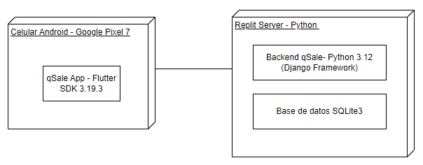

# **Demo: Backend Django monolítico**

Este proyecto muestra un **backend monolítico** desarrollado con **Django** y **Django REST Framework (DRF)**.  
Toda la lógica de negocio, rutas, modelos y controladores están concentradas en una única aplicación.



## **Comandos básicos — Backend Django**
### **1. Crear entorno virtual**

```bash
python -m venv venv
```

### **2. Activar el entorno virtual**
En windows:
```bash
venv\Scripts\activate
```
En Mac:
```bash
source venv/bin/activate
```

### **3. Instalar dependencias**

```bash
pip install -r requirements.txt
```


### **4. Ejecutar el servidor local**

```bash
python manage.py runserver
```
Actualmente, aunque la aplicación se encuentre documentada, se puede acceder a su versión en producción a través del backend desplegado en Railway, disponible en el siguiente enlace:
👉 https://appquesalebackend-production.up.railway.app

# **Tabla general de endpoints — Backend Django**

| Categoría | Método | Endpoint | Descripción |
|------------|---------|-----------|--------------|
| 🖼️ **Imágenes** | GET | `/images/<tipo>/<nombre>/` | Devuelve la imagen solicitada según su tipo y nombre. |
| 🔐 **Auth** | POST | `/auth/login` | Inicia sesión del usuario. |
| 🔐 **Auth** | POST | `/auth/register` | Registra un nuevo usuario. |
| 🔐 **Auth** | POST | `/auth/passwordReset` | Solicita un restablecimiento de contraseña (pendiente de confirmación). |
| 🔐 **Auth** | POST | `/auth/sendVerification` | Envía un correo de verificación al usuario. |
| 👤 **Usuario** | GET | `/user/info` | Obtiene la información del usuario autenticado. |
| 👤 **Usuario** | GET | `/user/events` | Lista los eventos asociados al usuario. |
| 🎟️ **Eventos** | POST | `/event/edit_or_create` | Crea o edita un evento existente. |
| 🎟️ **Eventos** | GET | `/event/categories` | Devuelve las categorías de eventos disponibles. |
| 🎟️ **Eventos** | GET | `/event/itemTypes` | Lista los tipos de ítems asociados a eventos. |
| 🎟️ **Eventos** | POST | `/event/setEventItem` | Asocia un ítem a un evento. |
| 🎟️ **Eventos** | GET | `/event/public` | Devuelve los eventos públicos. |
| 🎟️ **Eventos** | POST | `/event/favourite/` | Marca o desmarca un evento como favorito. |
| 🎟️ **Eventos** | GET | `/event/detail/` | Devuelve la información detallada de un evento. |
| 🎟️ **Eventos** | POST | `/event/deleteEventItem/` | Elimina un ítem de un evento. |
| 🎟️ **Eventos** | POST | `/event/setUserItem/` | Asocia un ítem a un usuario dentro de un evento. |
| 🎟️ **Eventos** | POST | `/event/deleteUserItem/` | Elimina un ítem asociado a un usuario. |
| 🎟️ **Eventos** | POST | `/event/addEventUser/` | Agrega un usuario participante a un evento. |
| 🎟️ **Eventos** | POST | `/event/deleteUserEvent/` | Elimina un usuario de un evento (requiere `event_id`). |
| 🎟️ **Eventos** | POST | `/event/setUserEventStatus/` | Actualiza el estado de un usuario en un evento. |
| 🎟️ **Eventos** | POST | `/event/deleteEvent/` | Elimina un evento completo (requiere `event_id`). |
