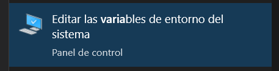
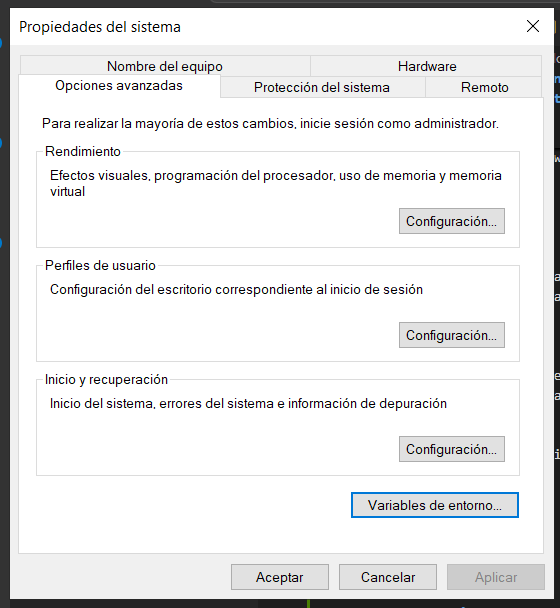
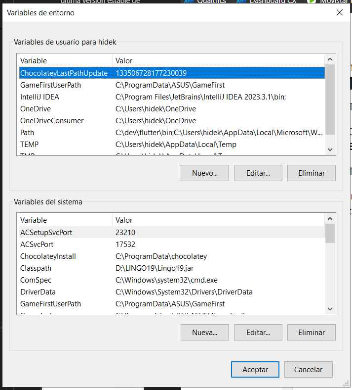
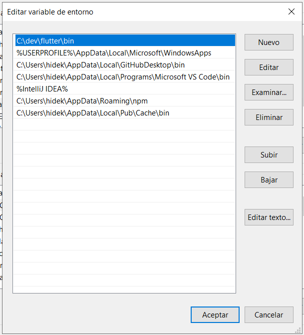
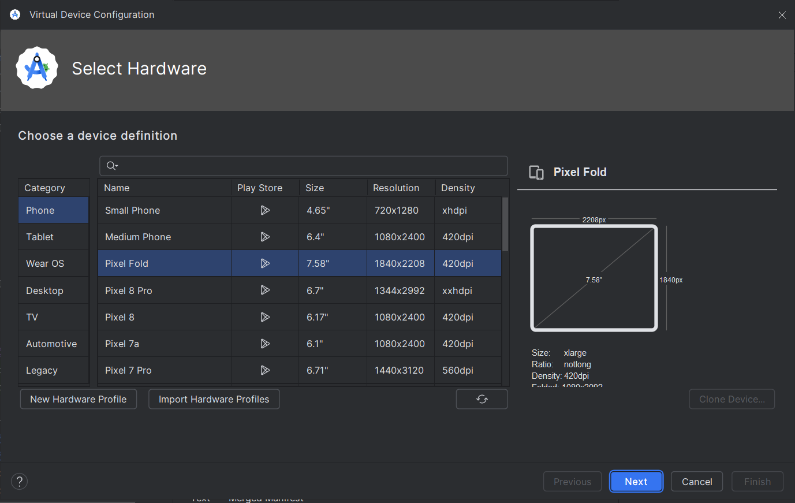
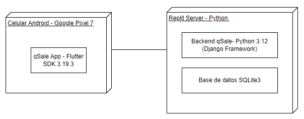
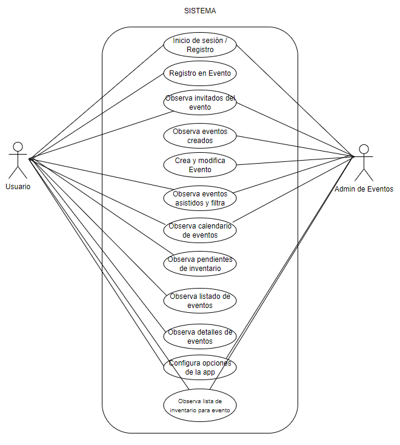
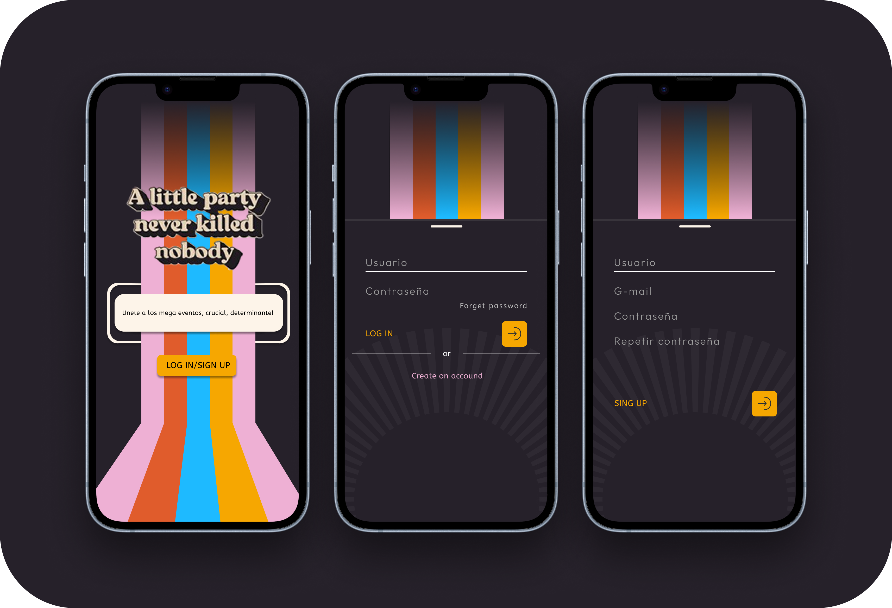
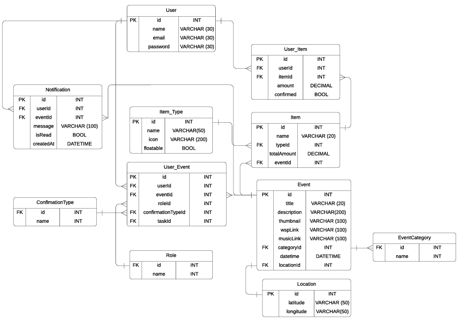

# Desarrollo de la aplicación para gestionar eventos "qSale"

## Integrantes
    - Hideki Sotero
    - Kohji Onaja
    - Walter Campos
    - Luis Martinez
    - Alvaro Sanchez

## Índice
- [Aspectos técnicos del software](#aspectos-técnicos-del-software)
    - [Entorno de desarrollo](#entorno-de-desarrollo)
    - [Diagrama de despliegue](#diagrama-de-despliegue)
    - [Requerimientos no funcionales](#requerimientos-no-funcionales)
    - [Diagrama de casos de uso](#diagrama-de-casos-de-uso)
    - [Requerimientos funcionales](#requerimientos-funcionales)
    - [Descripción de casos de uso](#descripción-de-casos-de-uso)


## Aspectos técnicos del software


### Entorno de desarrollo

---

El entorno de desarrollo que se utilizará para la aplicación de qSale será Flutter. Se tiene planeado usar el framework multiplataforma para poder desplegar la aplicación en móviles tanto en Android como iOS. Se utilizará todo lo que ofrece el lenguaje dart y las librerías de google para ofrecer al público una aplicación moderna y sencilla de usar. Gracias a la libreria de material3 se pueden mostrar componentes llamativos e intuitivos de usar. De este modo "qSale" será capaz de ofrecer una experiencia de usuario de alto nivel para crear, compartir y asistir a eventos de la comunidad.

<p align="center">
  
</p>

<p align="center">
  
</p>


Para iniciar con el desarrollo de la aplicacion primero fue necesario realizar el proceso de instalación de flutter framework.

#### **Verificación de los requerimeintos del sistema**

Flutter puede ser instalado y ejecutado tanto en windows como como macOS. En este caso nos centraremos en el uso del sistema operativo Windows. Para ello se recomiendan los siguientes requerimeintos en terminos de hardware.

| Requisito                       | Mínimo          | Recomendado      |
|----------------------------------|-----------------|------------------|
| Núcleos de CPU x86_64            | 4               | 8                |
| Memoria en GB                    | 8               | 16               |
| Resolución de pantalla en píxeles | WXGA (1366 x 768) | FHD (1920 x 1080) |
| Espacio libre en disco en GB     | 11.0            | 60.0             |

En términos de software se requiere que el sistema operativo de windows este actualizado ya sea windows 10 u 11. Estas dos versiones del sistema operativo soportan Flutter. Es necesario quw el sistema incluya Windows PowerShell 5 o superior.

#### **Herramientas de desarrollo**

Son dos las herramientas necesarias para poder realizar la compilación de código flutter correctamente

- La primera de ellas de Git, el servicio en la nube de control de versiones será necesario para guardar diferentes versiones del proyecto y poder desarrollar el código de forma colaborativa.

- La segunda y necesaria es Andorid Studio. Dado que se compilará en la aplicación en un dispositivo android, es necesario este entorno para moder crear dispositivos virtuales en los cuales se probarán las diferentes funciones del software. Asimismo, el entorno de desarrollo permite configurar las diferentes herramientas necesarias para el desarrollo y la instalación de SDK de andorid

- La tercera y opcional es xCode. Este editor de código permiote compilar el codigo de flutter en un dispositivo iOS. Del mismo modo que Android Studio se podrán configurar diferentes dispositivos con el sistema operativo de Apple y configurar diferentes herramientas de desarrollo.

#### **Configuración del editor de código o IDE**

Se pueden utilizar tres editores de código para el desarrollo de codigo en el framework de flutter en el lenguaje dart.
- VSCode
- Andorid Studio
- IntelliJ IDEA

#### **Intalación del SDK de Flutter**

En la misma web de desarrolladores de Flutter se encuentra disponible la versión más actual de flutter para su instalación en windows.

https://docs.flutter.dev/get-started/install/windows/mobile

1. Se debe descagar la última versión estable de flutter la cual viene en un archivo de tipo zip

2. Como segundo paso, se debe crear un directorio en el cual se va a realizar la instalación de flutter. Se recomienda crear un directorio de nombre "dev" en el disco principal.

3. Extraer el zip en el directorio creado para la instalación.

#### Actualización de la variable de entorno de windows

1. En el buscador de windows buscar: Variables de entorno.



2. Se abrira la siguiente ventana y se debe seleccionar la opción "Variables de entorno"



3. Emergerá una venta con las variables de entorno existentes en el dispositivo. Se debe seleccionar la opcion de "path" y seleccionar la opción "editar".



4. Dentro de la nueva ventana se debe colocar "nuevo" y colocar la ruta del directorio en el que se encuentra instalado flutter.



5. Finalmente para aplicar los cambios es necesario cerrar y abrir todas las terminales abiertas.

#### Configurar ambiente de Android

Es necesario instalas los siguientes componentes de Andorid que normalmente se instalan junto con Andorid Studio.

- Android SDK Platform, API 35.0.1
- Android SDK Command-line Tools
- Android SDK Build-Tools
- Android SDK Platform-Tools
- Android Emulator

De no estar activado algun componente se puede hacer desde la configuración de Android Studio.

#### Configurar Dispositivo Android

Para realizar la configuración de un dispositivo virtual es necesario crear un emulador desde Andorid Studio.



Se puede seleccionar el dispositivo de preferencia y la versión de Android a la que va dirigida la aplicación.

#### Aceptar las licencias de Android

Es necesario aceptar las licencias de andorid para poder compilar correctamente y que el entono de flutter funcione correctamiente.

Para ello se debe ejecutar el siguiente comando en la terminal.

```
C:> flutter doctor --android-licenses
```

Una vez ejecutado el comando se puede utilizar el comando flutter doctor para verificar que todo este instalado correctamente.

```
PS C:> flutter doctor
```

Si se siguieron todos los pasos solo debería faltar la instalaciuón de Visual Studio que no es necesario para el desarrollo de aplicaciones en FLutter.

### Diagrama de despliegue

---

<br>



El diagrama de despliegue representa la disposición física de los componentes del sistema mostrando como estos interactúan entre sí en una cierta infraestructura. 

Para el desarollo de nuestro proyecto utilizaremos un celular simulado modelo Google Pixel 7, el cual va a ejecutar nuestra app qSale desarrollada en FlutterSDK v3.19.3. Nuestro Backend y Base de datos se van a encontrar soportados en Replit. El backend qSale estará desarrollado en Python v3.12 usando el framework Django y la base de datos será una base de datos SQLite3.

### Requerimientos no funcionales

---

1. **Rendimiento**
- **Tiempo de respuesta**: La app debe responder a las interacciones del usuario en menos de **2 segundos** en la mayoría de las pantallas.
- **Velocidad de carga**: El tiempo de inicio de la aplicación no debe exceder los **5 segundos**.
- **Uso eficiente de recursos**: La app debe optimizar el uso de memoria y CPU del dispositivo, manteniendo el consumo de batería al mínimo durante su uso normal.

2. **Compatibilidad**
- **Dispositivos soportados**: La aplicación debe ser compatible con dispositivos Android con versiones **6.0 (Marshmallow)** o superior.
- **Responsiveness**: La app debe adaptarse a diferentes tamaños y resoluciones de pantalla, asegurando una experiencia consistente en teléfonos y tablets.

3. **Seguridad**
- **Autenticación**: Las credenciales de los usuarios deben ser protegidas mediante **encriptación**.
- **Privacidad**: La app debe cumplir con estándares básicos de **protección de datos personales**, asegurando que los datos sensibles no se compartan sin consentimiento.

4. **Mantenimiento**
- **Actualizaciones**: La arquitectura del código sigue un tipo de programación funcional y orientada a objetos manteniendo código limpio, garantizando que nuevas funcionalidades puedan ser agregadas sin grandes cambios al sistema.
- **Soporte para bugs**: El sistema debe incluir mecanismos para la **gestión de errores**.

5. **Usabilidad**
- **Interfaz amigable**: La aplicación debe tener una **UI intuitiva**, siguiendo principios de diseño como consistencia, simplicidad y accesibilidad considerado también en los colores.
- **Tiempos de aprendizaje**: Los nuevos usuarios deben poder aprender a usar la app en menos de **10 minutos**.

6. **Confiabilidad**
- **Tasa de disponibilidad**: La aplicación debe tener una **disponibilidad** de al menos el **99%**, minimizando tiempos de caída y errores críticos.

7. **Portabilidad**
- **Migración entre dispositivos**: La app debe permitir que los usuarios accedan a su cuenta desde diferentes dispositivos sin perder datos, utilizando sincronización con el servidor backend.

8. **Criterios de desarrollo**
- **Requisitos de desarrollo**: La app será desarrollada en FlutterSDK v3.19.3 , su backend será desarrollado en Python v3.12 usando el framework DJango y su base de datos será desarrollada en SQLite3.


### Diagrama de casos de uso

---

<br>



En el diagrama de casos de uso , podemos observar los distintos casos de uso para las entidades Usuario y Administrador de eventos en nuestro sistema. Podemos ver así cuales son los límites de nuestro sistema y que tanto abarca. 

### Requerimientos funcionales

---

1. **Inicio de sesión y registro**
- Ambos (Usuarios y Administradores): 
  - El sistema debe permitir el **registro de nuevos usuarios** y administradores mediante un formulario de registro con correo electrónico, contraseña y otros datos personales.
  - El sistema debe permitir el **inicio de sesión** para usuarios registrados, validando las credenciales.



2. **Registro de eventos**
- Administradores: 
  - Los administradores deben poder **crear nuevos eventos**, ingresando detalles como título, fecha, hora, lugar, descripción, y elementos del inventario necesarios (trago, snacks, etc.).
  - Los administradores deben poder **modificar los detalles de eventos** ya creados.
  - Los administradores deben poder **eliminar eventos**.

3. **Observar invitados a los eventos**
- Administradores: 
  - Los administradores deben poder **visualizar la lista de invitados** a cada evento.
  - Los administradores deben poder **invitar a personas** a los eventos o **eliminar invitados** de la lista.

4. **Observar eventos asistidos y filtrar**
- Ambos (Usuarios y Administradores): 
  - Los usuarios y administradores deben poder **ver una lista de eventos a los que han asistido**.
  - Los usuarios deben poder **filtrar eventos** por fecha, lugar, o tipo de evento.
  
5. **Observar calendario de eventos**
- Ambos (Usuarios y Administradores): 
  - La aplicación debe permitir a los usuarios y administradores **visualizar los eventos programados** en un calendario interactivo, mostrando fechas y horas de los eventos.


6. **Observar pendientes de inventario**
- Administradores: 
  - Los administradores deben poder **ver un listado de pendientes** de inventario para cada evento, como bebidas, comida, decoración, etc.
  - Los administradores deben poder **gestionar el estado de los elementos** de inventario, marcando si están pendientes, en proceso o completados.

7. **Observar listado de eventos**
- Ambos (Usuarios y Administradores): 
  - La aplicación debe mostrar un **listado general de todos los eventos** a los usuarios y administradores, permitiendo ver tanto los eventos futuros como los pasados.

8. **Observar detalles de los eventos**
- Ambos (Usuarios y Administradores): 
  - Tanto usuarios como administradores deben poder **ver los detalles completos de un evento**, que incluyen la fecha, lugar, descripción y otros datos relevantes.


9. **Configurar opciones de la app**
- Ambos (Usuarios y Administradores): 
  - Los usuarios y administradores deben poder **configurar ajustes** personales en la aplicación, como notificaciones, idioma, privacidad, entre otros.

10. **Observar lista de inventario para evento**
- Administradores: 
  - Los administradores deben poder **visualizar y gestionar el inventario** completo de cada evento, viendo la cantidad de elementos disponibles y lo que aún falta por gestionar.


#### Diferenciación de Roles
- **Usuarios**: 
  - Pueden observar los eventos a los que asisten.
  - Pueden observar los detalles y filtrar eventos.
  
- **Administradores**: 
  - Tienen control sobre la creación, modificación, y eliminación de eventos.
  - Pueden gestionar el inventario, lista de invitados, y observar pendientes del evento.
  - Tienen acceso a un calendario global de eventos.


### Descripción de casos de uso

---

1. **Inicio de sesión / Registro (Usuario, Admin de Eventos):** 

El usuario puede registrarse como usuario y accede a su cuenta con su información privada.

2. **Registro en Evento (Usuario):**

El usuario pueden registrarse en diversos eventos que puede explorar

3. **Observa invitados del evento (Usuario, Admin de Eventos):** 

Los usuarios y administradores pueden ver quienes asisten a los respectivos eventos

4. **Observa eventos creados (Usuario, Admin de Eventos):** 

Los usuarios y administradores pueden ver que eventos han creado

5. **Crea y modifica Evento (Usuario, Admin de Eventos):** 

Los usuarios y administradores pueden crear y editar los eventos que han creado

6. **Observa eventos asistidos y filtra (Usuario, Admin de Eventos):**

Los usuarios y administradores pueden observar a que eventos han asistido y pueden filtrarlos

7. **Observa calendario de eventos (Usuario, Admin de Eventos):** 

Los usuarios y administradores tienen un calendario donde pueden observar los eventos que tienen para el mes actual

8. **Observa pendientes de inventario (Usuario):** 

El usuario puede ver que items pendientes tiene para los distintos eventos o si ya estan completos o cuales son en defecto.


9. **Observa listado de eventos (Usuario):** 

El usuario puede observar el listado de eventos principal donde puede explorar los distintos eventos que existen en la app

10. **Observa detalles de eventos (Usuario):** 

El usuario puede desplegar las descripciones de cada evento con todos los detalles

11. **Configura opciones de la app (Usuario, Admin de Eventos):** 

Los usuarios y administradores pueden configurar ciertas opciones como su cuenta, activar notificaciones , temas de privacidad y seguridad , acerca de la app y cerrar sesión.

12. **Observa lista de inventario para evento (Admin de Eventos):** El usuario puede ver que items necesita el evento y cuales se les ha asignado a él respectivamente.

### Diagrama Entidad Relación

---

<br>


