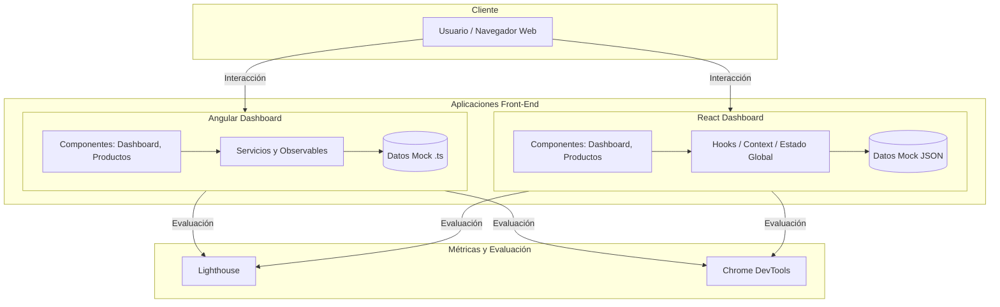
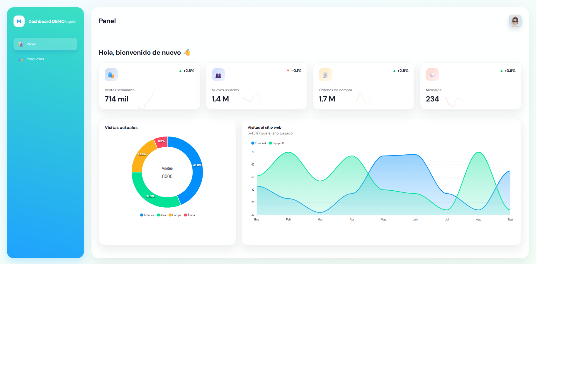
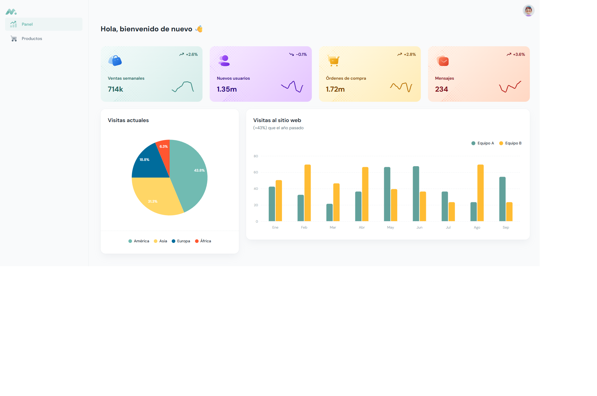

> [0. Acerca del Grupo](../../0.md) › [0.6. Temas Individuales (Parte 1)](../0.6.md) › [0.6.3. Integrante 3](0.6.3.md)

# 0.6.3. Integrante 3

# Comparación de Frameworks Front-End

## ¿Qué es un Framework?

Un **framework** es un conjunto estructurado de herramientas, librerías y convenciones que proporciona una base predefinida para el desarrollo de software.  
Define una arquitectura y un flujo de trabajo que guía al desarrollador sobre:

- Cómo estructurar el código  
- Qué componentes utilizar y cómo interactúan  
- Qué patrones y convenciones seguir  

---

## Frameworks en Arquitectura de Software

En la **arquitectura de software**, un framework representa una **implementación parcial de una arquitectura**, donde el desarrollador completa los espacios definidos por este.  
Esto permite:

- Reutilización estructurada del código  
- Consistencia arquitectónica  
- Aplicación de **patrones de diseño** (como MVVM o MVC)  

Frameworks como **Angular**, **React**, **Vue** o **Svelte** aplican estos principios, con distintos niveles de estructura y flexibilidad.

---

## Frameworks Front-End

Los frameworks front-end surgieron para manejar **interfaces dinámicas y reactivas**, actualizando vistas sin recargar la página completa.

### Principales características:
- Renderizado dinámico de vistas  
- Gestión eficiente del estado  
- Integración con APIs  
- Ruteo dinámico y modularidad  

---

## Frameworks más representativos

| Framework | Descripción |
|------------|--------------|
| **Angular** | Framework completo con arquitectura modular, servicios e inyección de dependencias. Ideal para proyectos grandes y estructurados. |
| **React** | Biblioteca enfocada en la vista, flexible y basada en componentes reutilizables. Permite mayor libertad en la arquitectura. |

---

## Comparativa desde la Perspectiva Arquitectónica

| Criterio | Angular | React |
|-----------|----------|--------|
| **Tipo de herramienta** | Framework completo (MVVM) | Biblioteca de UI |
| **Arquitectura** | Modular, con servicios e inyección de dependencias | Basada en componentes funcionales y virtual DOM |
| **Lenguaje base** | TypeScript | JavaScript / TypeScript |
| **Curva de aprendizaje** | Alta, estructurada | Media, más flexible |
| **Control del flujo** | Declarativo y jerárquico | Declarativo y funcional |
| **Comunicación** | Input/Output + Observables | Props + Estado unidireccional |
| **Rendimiento (LCP/TTFB)** | Inicial más lento por carga del framework | Rápido al renderizar componentes ligeros |

---

## Comparación desde la Perspectiva de Programación

| Criterio | Angular | React |
|-----------|----------|--------|
| **Renderizado** | DOM real con Change Detection | Virtual DOM |
| **Inyección de dependencias** | Automática con decoradores | Manual mediante contextos o hooks |
| **Ciclo de vida del componente** | Métodos (ngOnInit, ngAfterViewInit) | Hooks (useEffect, useState) |
| **Formularios** | Template y Reactive Forms nativos | Librerías externas (Formik, React Hook Form) |
| **Ruteo** | Integrado (guards, resolvers, lazy load) | React Router (librería externa) |
| **Estilos** | SCSS encapsulado por componente | Inline styles o librerías (Styled Components, MUI) |
| **Bundle inicial** | Más grande (≈ 500–800 KB) | Más ligero (≈ 250–400 KB) |

---

## Pruebas de Rendimiento y Usabilidad (Demo Comparativa)

### Escenario de Prueba

Se desarrollaron **dos dashboards** (uno en Angular y otro en React) con las mismas funcionalidades:

- Lista de productos  
- Filtro por categoría  
- Búsqueda con debounce  
- Paginación dinámica  
- Vista de detalle del producto  

---

## Métricas Evaluadas (Lighthouse / Chrome DevTools)

| Métrica | Angular | React |
|----------|----------|--------|
| **TTFB (Time to First Byte)** | 0.09 s | 0.07 s |
| **LCP (Largest Contentful Paint)** | 2.5 s | 1.9 s |
| **Bundle Size** | 750 KB | 380 KB |
| **Render Re-renders** | 5 | 3 |
| **CLS (Cumulative Layout Shift)** | 0.01 | 0.02 |

Resultado: React mostró **mejor rendimiento inicial**, mientras que Angular destacó en **mantenibilidad y estructura**.

---

## Prueba de Rendimiento Real (Demo con Chrome DevTools)

Durante la ejecución práctica de ambos proyectos, se registraron las métricas reales utilizando **Chrome DevTools (Performance y Network tabs)** bajo condiciones de red simulada *Fast 4G* y CPU sin limitaciones.  
Los valores obtenidos se detallan a continuación:

### Comparativa de Métricas de Carga — React vs Angular

| **Métrica** | **Descripción** | **React** | **Angular** | **Interpretación / Comentario** |
|--------------|-----------------|--------------------|----------------------|----------------------------------|
| **TTFB (Time To First Byte)** | Tiempo hasta recibir el primer byte del servidor. | **197 ms** | **187 ms** | Ambos rápidos; respuesta del servidor casi idéntica. |
| **DOMContentLoaded** | Momento en que el DOM está completamente cargado. | **587 ms** | **4.38 s** | Angular tarda más en parsear y construir el DOM inicial. |
| **Load (onLoad)** | Página completamente cargada (recursos + scripts). | **1.23 s** | **5.43 s** | React finaliza la carga completa mucho antes. |
| **Finish (transferencia total)** | Fin de todas las solicitudes de red. | **1.45 s / 624 KB / 26 req** | **5.77 s / 3.4 MB / 32 req** | Angular requiere más archivos y mayor peso total. |
| **LCP (Largest Contentful Paint)** | Carga del elemento visual principal. | **0.96 s** | **4.75 s** | React renderiza su contenido principal 5× más rápido. |
| **CLS (Cumulative Layout Shift)** | Estabilidad visual durante la carga. | **0.01** | **0.00** | Ambos muy estables, sin movimientos visuales. |
| **INP (Interaction to Next Paint)** | Latencia al interactuar (clic, input). | **0 ms** | **0 ms** | Ambos responden instantáneamente. |

---

### Interpretación general

- **React**: más **ligero, rápido y eficiente** en carga inicial.  
- **Angular**: más **robusto y estructurado**, pero con mayor costo de arranque.  
- Las diferencias se deben principalmente al **tamaño del bundle** y al **bootstrap inicial del framework Angular**.  

**Conclusión de la demo:**
> **React** prioriza velocidad y ligereza.  
> **Angular** prioriza estructura, mantenibilidad y modularidad a largo plazo.

---

## Experiencia de Desarrollo (DX)

| Aspecto | Angular | React |
|-----------|----------|--------|
| **Configuración inicial** | Completa (CLI, módulos, estructura establecida) | Rápida (Vite, CRA o Next.js) |
| **Ecosistema** | Unificado, controlado por Google | Abierto y diverso, mantenido por Meta y la comunidad |
| **Modularidad** | Nativa y estructurada | Flexible, depende del desarrollador |
| **Aprendizaje** | Mayor curva, pero más guiada | Más intuitivo, menos restrictivo |

---

## Estructura de los Proyectos (Demo)

```text
ComparativaDashboards/
├─ angular-dashboard/
│  ├─ src/app/
│  │  ├─ components/
│  │  ├─ services/
│  │  ├─ pages/
│  │  └─ app.module.ts
│  └─ angular.json
│
└─ react-dashboard/
   ├─ src/
   │  ├─ components/
   │  ├─ hooks/
   │  ├─ pages/
   │  └─ App.jsx
   └─ vite.config.js
```

Cada proyecto implementa el mismo flujo funcional para comparar rendimiento, estructura y facilidad de desarrollo.

---

## Diagrama de la Demo (Arquitectura de Componentes)

> La demo tiene **dos funcionalidades espejo** en ambos frameworks: **Dashboard** y **Lista de Productos**.  
> Ambos consumen datos mock y se miden con Lighthouse/DevTools.



---

## Features implementadas por cada Front

| Feature | Angular (paths) | React (paths) |
|---|---|---|
| **Dashboard** | `src/app/pages/dashboard` + `components/*` | `src/pages/dashboard.tsx` + `src/sections/overview/*` |
| **Lista de productos** | `src/app/pages/products` + `components/*` | `src/pages/products.tsx` + `src/sections/product/*` |
| **Datos mock** | `src/app/pages/dashboard/dashboard.data.ts` | `src/_mock/*` |
| **Métricas** | Lighthouse + DevTools | Lighthouse + DevTools |

> Con esta tabla y el diagrama se evidencia que la **misma funcionalidad** se implementa en ambos frentes para una comparación justa.

---

## Herramientas y Configuración

- **Angular:** CLI 18.2.14, TypeScript 5.5, Angular Material  
- **React:** Vite + React 18.3, MUI, Axios  
- **Métricas:** Chrome Lighthouse / DevTools (Performance Tab)  
- **Modo de red:** Throttling “4G fast”  
- **Ambiente local:** `localhost` con build optimizado (`ng build --prod` / `vite build`)

---

## DEMO

### Angular Dashboard

**Instalación y ejecución:**
```bash
cd angular-dashboard
npm install
ng serve --open
```

**Build para pruebas de rendimiento:**
```bash
ng build --configuration production
npx http-server ./dist/angular-dashboard -p 4200
```

---

### React Dashboard

**Instalación y ejecución:**
```bash
cd react-dashboard
npm install
npm run dev
```

**Build optimizado para Lighthouse:**
```bash
npm run build
npx serve dist
```

---

## Resultados Visuales

### Dashboard Angular



### Dashboard React



---

## Conclusión

- **React** ofrece un **rendimiento inicial superior** y una curva de aprendizaje más accesible.  
- **Angular** proporciona una **arquitectura robusta y mantenible**, ideal para proyectos de gran escala.  
- Ambos frameworks son altamente eficientes, pero su elección depende del contexto del proyecto.  

**Conclusión general:**  
> **Angular = estructura y mantenibilidad.**  
> **React = rapidez y flexibilidad.**

---
## Video en YouTube

**El siguiente enlace dirige al video donde se explica el desarrollo y comparación de ambos frameworks front-end (Angular y React).**  
- [https://www.youtube.com/watch?v=DvHtHAAi3M8](https://www.youtube.com/watch?v=DvHtHAAi3M8)

---

[⬅️ Anterior](../0.6.2/0.6.2.md) | [🏠 Home](../../../README.md) | [Siguiente ➡️](../0.6.4/0.6.4.md)
