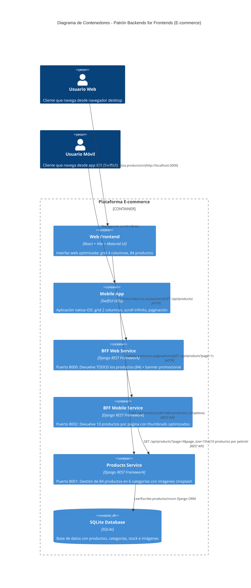

> [0. Acerca del Grupo](../../0.md) › [0.7. Trabajo Individual (Patrones Cloud)](../0.7.md) › [0.7.1. Integrante 1](0.7.1.md)

# 0.7.1. Integrante 1

El patrón **Backends for Frontends** (BFF) es un patrón arquitectónico que propone crear backends especializados para cada tipo de interfaz de usuario (web, móvil, desktop).  
Su propósito principal es optimizar la experiencia del usuario proporcionando APIs específicas adaptadas a las capacidades y restricciones de cada cliente, evitando la complejidad de un backend monolítico que intenta servir a todos los frontends simultáneamente.

--- 

## 2. Problema

En una arquitectura tradicional, un **único backend** sirve a múltiples tipos de clientes: aplicaciones web, móviles, desktop, smartwatches, etc.  
Esto genera varios problemas:

- **Sobrecarga del backend compartido**: El servicio debe manejar lógica específica para cada cliente, aumentando su complejidad.
- **Conflictos entre equipos**: Los equipos frontend de web y móvil compiten por recursos y prioridades en el backend.
- **Compromiso en la experiencia de usuario**: Las APIs deben ser genéricas, sacrificando optimizaciones específicas de cada plataforma.
- **Cuellos de botella en desarrollo**: Cada cambio requiere coordinación entre múltiples equipos y validación cruzada.
- **Sobrefetching/Underfetching**: El cliente web puede necesitar más datos que el móvil, generando transferencias innecesarias o múltiples peticiones.

En un **e-commerce**, la aplicación móvil necesita respuestas ligeras y paginadas para conservar ancho de banda, mientras que la web puede cargar múltiples productos, imágenes de alta resolución y secciones completas en una sola petición.

---

## 3. Solución: Patrón Backends for Frontends (BFF)

El patrón propone crear un **backend dedicado para cada tipo de frontend**, actuando como una capa intermedia entre el cliente y los microservicios backend.

### Estructura básica:

1. **Cliente Web (React/Vite)**  
   Se comunica con su propio BFF optimizado para experiencias de escritorio.  
   Obtiene respuestas con **todos los productos** (84 productos) en una sola petición, con imágenes de alta resolución y datos completos.

2. **Cliente Móvil (SwiftUI - iOS)**  
   Se comunica con su propio BFF optimizado para dispositivos móviles.  
   Obtiene respuestas **paginadas** (10 productos por página) con thumbnails optimizados e implementa scroll infinito.

3. **BFF Services (Django/Python + Django REST Framework)**  
   - **BFF Web** (puerto 8000): Solicita TODOS los productos usando endpoint `/all/` sin paginación.
   - **BFF Mobile** (puerto 8002): Implementa paginación estándar con `page_size=10`.
   
   Cada BFF maneja la lógica específica del cliente: agregación de datos, transformación, y optimizaciones.  
   Los BFFs se comunican con el microservicio de productos para obtener los datos necesarios.

4. **Microservicio Backend (Products Service)**  
   - **Django/Python** con Django REST Framework (puerto 8001)
   - Contiene **84 productos** distribuidos en 6 categorías: Electrónica, Ropa, Hogar, Deportes, Libros, Juguetes
   - Base de datos SQLite con gestión de productos, categorías, imágenes y stock
   - Endpoints: `/api/products/` (paginado) y `/api/products/all/` (sin paginación)
   - Imágenes alojadas en Unsplash con URLs de alta resolución y thumbnails

---

## 4. Conceptos clave

| Concepto | Descripción |
|-----------|--------------|
| **Separación de responsabilidades** | Cada BFF se enfoca exclusivamente en las necesidades de su cliente, sin comprometer otros frontends. |
| **Autonomía de equipos** | Los equipos frontend pueden desarrollar y desplegar sus BFFs independientemente. |
| **Optimización específica** | BFF Web carga todos los productos; BFF Mobile implementa paginación y scroll infinito. |
| **Reducción de complejidad** | El backend central no necesita conocer las particularidades de cada frontend. |
| **Mejor rendimiento** | Se eliminan sobrefetching/underfetching al tener APIs perfectamente adaptadas. |

---

## 5. Casos de aplicación reales

| Industria | Escenario de uso | Descripción |
|------------|------------------|--------------|
| **E-commerce** | Web vs Móvil | BFF web devuelve 84 productos completos; BFF móvil devuelve 10 productos por página con thumbnails. |
| **Streaming (Netflix, Spotify)** | Smart TV vs Móvil | BFF de TV envía contenido 4K y múltiples episodios; BFF móvil optimiza para conexiones lentas. |
| **Banking** | App móvil vs Portal web | BFF móvil ofrece funciones simplificadas; BFF web incluye reportes detallados. |
| **Social Media** | Web vs App nativa | BFF web carga feeds completos; BFF móvil implementa infinite scroll optimizado. |

---

## 6. Aplicación en el proyecto grupal

En el proyecto de **plataforma e-commerce**, se aplicó este patrón para **optimizar la experiencia de compra** según el dispositivo:

> Se crearon dos BFF services:  
> - **BFF Web** (Django/DRF - puerto 8000): Obtiene todos los productos usando el endpoint `/products/all/` y agrega metadatos como fuente de datos.
> - **BFF Mobile** (Django/DRF - puerto 8002): Implementa paginación con `page=1&page_size=10`, devolviendo respuestas ligeras optimizadas para conexiones móviles.
>
> Ambos BFFs se comunican con el mismo microservicio **Products Service** (puerto 8001), pero transforman y optimizan las respuestas según las necesidades del cliente.

---

### Flujo de ejecución

**Para cliente Web (React/Vite):**
1. El usuario accede al catálogo desde un navegador en `http://localhost:3000`.
2. El frontend React llama a `GET http://localhost:8000/api/products`.
3. El **BFF Web** consulta el endpoint `/api/products/all/` del Products Service.
4. El BFF recibe los 84 productos completos y agrega metadatos:
```json
   {
     "products": [...84 productos...],
     "metadata": {
       "total": 84,
       "page_size": 84,
       "source": "BFF Web - Optimizado para escritorio"
     },
     "featured_banner": {
       "title": "Ofertas de Black Friday",
       "discount": "50% OFF"
     }
   }
```
5. La web muestra todos los productos en un grid de 4 columnas (lg), con imágenes de 800x600px y datos completos.

**Para cliente Móvil (SwiftUI - iOS):**
1. El usuario accede al catálogo desde la app móvil.
2. La app llama a `GET http://192.168.1.49:8002/api/products?page=1`.
3. El **BFF Mobile** consulta `/api/products/?page=1&page_size=10` del Products Service.
4. El BFF devuelve 10 productos con datos optimizados:
```json
   {
     "results": [...10 productos...],
     "page": 1,
     "page_size": 10,
     "source": "BFF Mobile - Optimizado para iOS"
   }
```
5. Al hacer scroll, automáticamente carga la página 2, 3, etc. (scroll infinito).

---

## 7. Arquitectura Dockerizada

Cada componente se ejecuta como un **contenedor independiente**:

| Servicio | Imagen base | Puerto | Rol |
|-----------|--------------|--------|------|
| **web-frontend** | `node:20-alpine` | 3000 | Cliente web React/Vite con Material-UI. |
| **bff-web** | `python:3.11-slim` | 8000 | Backend for Frontend web (Django/DRF). |
| **bff-mobile** | `python:3.11-slim` | 8002 | Backend for Frontend móvil (Django/DRF). |
| **products-service** | `python:3.11-slim` | 8001 | Microservicio de productos (Django/DRF + SQLite). |

### Estructura del proyecto:
```
Demo/
├── docker-compose.yml
├── web-frontend/          # React + Vite + MUI
│   ├── Dockerfile
│   ├── package.json
│   └── src/
│       ├── components/
│       │   ├── ProductList.tsx
│       │   ├── ProductCard.tsx
│       │   └── Banner.tsx
│       ├── services/
│       │   └── productService.ts
│       └── types/
│           └── product.ts
├── bff-web/              # Django BFF Web
│   ├── Dockerfile
│   ├── requirements.txt
│   └── api/
│       ├── views.py      # Llama a /products/all/
│       └── urls.py
├── bff-mobile/           # Django BFF Mobile
│   ├── Dockerfile
│   ├── requirements.txt
│   └── api/
│       ├── views.py      # Implementa paginación
│       └── urls.py
└── products-service/     # Microservicio Products
    ├── Dockerfile
    ├── requirements.txt
    ├── products/
    │   ├── models.py     # Product, Category
    │   ├── serializers.py
    │   ├── views.py      # ViewSet con /all/ endpoint
    │   └── management/
    │       └── commands/
    │           └── create_sample_data.py  # 84 productos
    └── products_service/
        └── settings.py   # PAGE_SIZE = 10
```

---

## 8. Diagrama de contenedores (C4 Model – Nivel C2)


---

## 9. Ventajas de implementar BFF en el proyecto

✅ **Experiencia optimizada**: Web carga todos los productos instantáneamente; móvil usa scroll infinito eficiente.  
✅ **Desarrollo independiente**: Equipos web (React) y móvil (SwiftUI) trabajan sin bloqueos mutuos.  
✅ **Mejor rendimiento**: Web evita múltiples peticiones; móvil conserva ancho de banda con paginación.  
✅ **Escalabilidad selectiva**: Se puede escalar BFF Mobile independientemente si aumenta tráfico móvil.  
✅ **Simplicidad en microservicios**: Products Service permanece simple y agnóstico al tipo de cliente.  
✅ **Contenedorización**: Docker Compose permite levantar toda la arquitectura con un solo comando.  
✅ **Optimización de imágenes**: Web usa imágenes HD (800px); móvil usa thumbnails (300px).  

---

## 10. Comandos para ejecutar el proyecto
```bash

cd Demo

# Levantar todos los servicios
docker-compose up --build

# Acceder a los servicios
# - Web Frontend: http://localhost:3000
# - BFF Web: http://localhost:8000/api/products
# - BFF Mobile: http://localhost:8002/api/products
# - Products Service: http://localhost:8001/api/products

# Ver logs de un servicio específico
docker-compose logs -f bff-web

# Recrear la base de datos con productos
docker-compose exec products-service python manage.py migrate
docker-compose exec products-service python manage.py create_sample_data

# Detener todos los servicios
docker-compose down
```

---

## 11. Tecnologías utilizadas

### Frontend:
- **Web**: React 18 + Vite + TypeScript + Material-UI v5 + Axios
- **Mobile**: SwiftUI + Combine + AsyncImage + iOS 18+

### Backend (BFFs):
- **Framework**: Django 4.2 + Django REST Framework 3.14
- **Python**: 3.11
- **HTTP Client**: requests library

### Microservicio:
- **Framework**: Django 4.2 + Django REST Framework 3.14
- **Base de datos**: SQLite (development)
- **ORM**: Django ORM
- **Serialización**: DRF Serializers

### DevOps:
- **Containerización**: Docker + Docker Compose
- **Networking**: Red bridge personalizada (bff-network)
- **Variables de entorno**: PRODUCTS_SERVICE_URL, VITE_API_URL

---

## 12. Video en YouTube

**El siguiente enlace lleva a un video de YouTube que explica el patrón BFF implementado en este proyecto:**  
- [Arquitectura de Software (Patrón BFF) - Kohji Onaja](https://youtu.be/eZfe566NTR8)

---

## 13. Conclusiones

La implementación del patrón **Backends for Frontends** en este proyecto demuestra cómo una arquitectura bien diseñada puede optimizar significativamente la experiencia del usuario según el dispositivo:

1. **Separación clara de responsabilidades**: Cada BFF se enfoca exclusivamente en su cliente sin comprometer otros.
2. **Optimización específica**: Web obtiene todos los datos en una petición; móvil usa paginación eficiente.
3. **Escalabilidad**: Los servicios pueden escalar independientemente según la demanda.
4. **Mantenibilidad**: Cambios en un BFF no afectan al otro ni al microservicio central.
5. **Rendimiento**: Se eliminan roundtrips innecesarios y se optimiza el uso de ancho de banda.

El uso de **Docker** facilita el despliegue y la consistencia entre ambientes, mientras que **Django REST Framework** proporciona una base sólida y productiva para construir APIs REST robustas.

---

[🏠 Home](../../../README.md) | [Siguiente ➡️](../0.7.2/0.7.2.md)