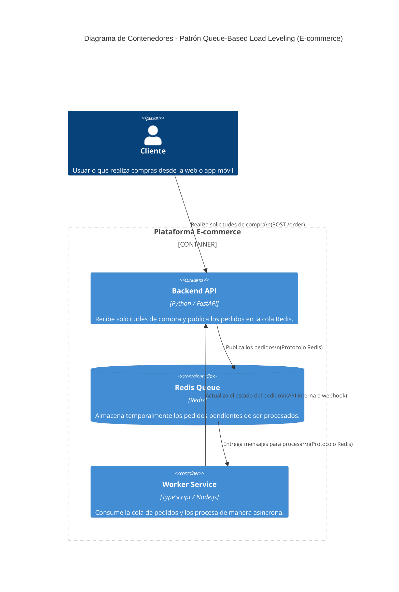

> [0. Acerca del Grupo](../../0.md) › [0.7. Trabajo Individual (Patrones Cloud)](../0.7.md) › [0.7.2. Integrante 2](0.7.2.md)

# 0.7.2. Integrante 2 - Implementación del Patrón Cloud: Queue-Based Load Leveling

El patrón **Queue-Based Load Leveling** (nivelación de carga basada en colas) es uno de los patrones de resiliencia más utilizados en arquitecturas cloud.  
Su propósito principal es **desacoplar** los componentes del sistema que producen cargas variables (productores) de los que las procesan (consumidores), asegurando una ejecución **estable y escalable**, incluso ante picos de demanda.

---

## 2. Problema

En una arquitectura tradicional de microservicios, el backend puede **saturarse** cuando múltiples clientes realizan solicitudes simultáneamente.  
Esto genera:

- Sobrecarga de CPU o base de datos.  
- Errores 500 por timeouts.  
- Lentitud en el procesamiento de peticiones críticas (como pagos o registros).

En el caso de un **e-commerce**, las operaciones de creación de pedidos o pagos son costosas y sensibles.  
Si todos los usuarios envían solicitudes de compra al mismo tiempo (por ejemplo, en Black Friday), el backend colapsa.

---

## 3. Solución: Patrón Queue-Based Load Leveling

El patrón propone introducir una **cola intermedia** entre el productor (API de entrada) y el consumidor (servicio que procesa).

### Estructura básica:

1. **Productor (FastAPI)**  
   Recibe solicitudes HTTP y **coloca los mensajes en una cola** (Redis).  
   Responde inmediatamente al usuario con un código de éxito, sin bloquear la operación.

2. **Cola (Redis / RabbitMQ / Azure Queue)**  
   Almacena temporalmente las tareas pendientes.  
   Sirve como **buffer** entre productor y consumidor.

3. **Consumidor (Worker en TypeScript)**  
   Extrae los mensajes de la cola y los procesa de manera **asíncrona** y **controlada**.  
   Puede escalar horizontalmente para manejar más carga.

---

## 4. Conceptos clave

| Concepto | Descripción |
|-----------|--------------|
| **Desacoplamiento** | El productor no depende de la velocidad o disponibilidad del consumidor. |
| **Elasticidad** | Pueden agregarse múltiples consumidores (workers) según la carga. |
| **Resiliencia** | La cola actúa como amortiguador, evitando que se pierdan mensajes ante fallos temporales. |
| **Persistencia temporal** | Redis o RabbitMQ garantizan que los mensajes no se pierdan si el consumidor falla momentáneamente. |
| **Escalabilidad** | Permite manejar picos de tráfico sin aumentar la carga del API principal. |

---

## 5. Casos de aplicación reales

| Industria | Escenario de uso | Descripción |
|------------|------------------|--------------|
| **E-commerce** | Procesamiento de pedidos | Cada compra se encola para ser procesada por un worker sin bloquear al cliente. |
| **Finanzas** | Validación de transacciones | Un API recibe pagos y los valida en segundo plano. |
| **IoT** | Recepción de datos masivos | Los dispositivos publican datos que luego se procesan por lotes. |
| **Medios digitales** | Procesamiento de imágenes o videos | Cada carga se encola y se transforma de forma asíncrona. |

---

## 6. Aplicación en el proyecto grupal

En el proyecto de **plataforma e-commerce**, se aplicó este patrón en el **módulo de pedidos**:

> Al recibir un nuevo pedido, el backend desarrollado en **FastAPI** lo coloca en una **cola Redis**.  
> Un **worker en TypeScript** consume los mensajes, simulando el procesamiento del pago y la actualización del stock.  
> La base de datos fue **simulada dentro del backend** para concentrar el enfoque en el patrón, evitando dependencias externas.

---

### Flujo de ejecución

1. El usuario realiza una compra (`POST /order`).  
2. El backend (FastAPI) la envía a una cola `orders_queue` en Redis.  
3. El API responde `202 Accepted` inmediatamente.  
4. El worker en TypeScript lee la cola y procesa los pedidos.  
5. Se registra la ejecución en consola (simulando inserción en DB).

---

## 7. Arquitectura Dockerizada

Cada componente se ejecuta como un **contenedor independiente**:

| Servicio | Imagen base | Rol |
|-----------|--------------|------|
| **api** | `python:3.11-slim` | Productor — expone endpoints REST (FastAPI). |
| **worker** | `node:20` | Consumidor — procesa pedidos de la cola. |
| **redis** | `redis:7` | Sistema de mensajería intermedio. |

---

### 8. Diagrama de contenedores (C4 Model – Nivel C2)

---

[⬅️ Anterior](../0.7.1/0.7.1.md) | [🏠 Home](../../../README.md) | [Siguiente ➡️](../0.7.3/0.7.3.md)