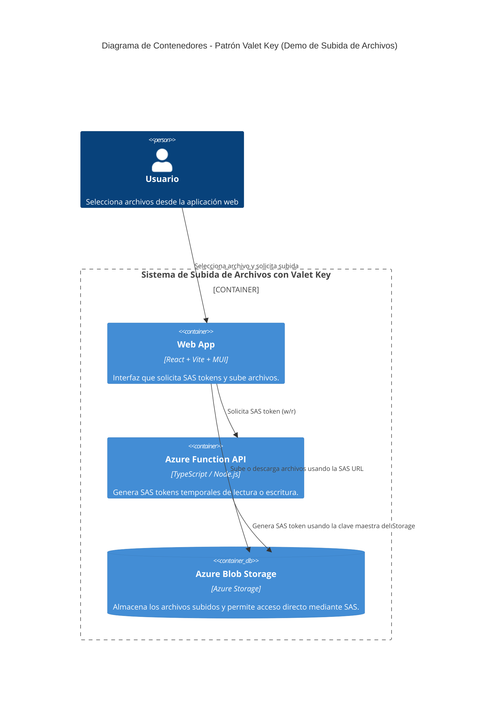
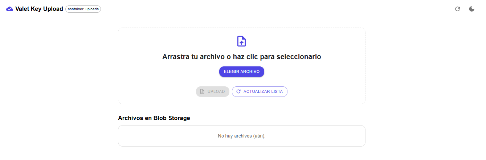

> [0. Acerca del Grupo](../../0.md) › [0.7. Trabajo Individual (Patrones Cloud)](../0.7.md) › [0.7.3. Integrante 3](0.7.3.md)

# 0.7.3. Integrante 3 – Implementación del Patrón Cloud: Valet Key Pattern

El patrón **Valet Key Pattern** es un patrón de **seguridad y acceso controlado** en la nube, cuyo objetivo es otorgar acceso **temporal, seguro y limitado** a recursos de almacenamiento o APIs sin exponer las credenciales principales.  
Se aplica ampliamente en plataformas que utilizan servicios de almacenamiento en la nube, como **Azure Blob Storage**, **Amazon S3** o **Google Cloud Storage**.

---

## 2. Problema

En una arquitectura tradicional, los clientes que necesitan subir o descargar archivos deben enviar sus datos **al backend**, y este a su vez los reenvía al servicio de almacenamiento.  
Este enfoque presenta varios problemas:

- El backend se sobrecarga con el tráfico y el procesamiento de archivos grandes.  
- Aumenta el costo de red y tiempo de respuesta.  
- Exponer directamente las **credenciales del almacenamiento** sería un riesgo crítico de seguridad.  
- Dificulta el control granular del acceso, como permisos temporales o específicos por archivo.

Por lo tanto, se requiere una forma de **delegar acceso directo al almacenamiento**, sin comprometer la seguridad ni el control.

---

## 3. Solución: Patrón Valet Key

El patrón **Valet Key** propone que el backend genere una **llave temporal (token)** que otorga al cliente acceso **directo al servicio de almacenamiento** por un tiempo limitado y con permisos específicos (por ejemplo, solo lectura o escritura).

### Estructura básica:

1. **Cliente (Frontend React)**  
   Solicita al backend una llave temporal para subir o descargar un archivo.

2. **Backend (Azure Function)**  
   Genera una **SAS (Shared Access Signature)**, que actúa como la “valet key”:  
   - Define permisos (`r` lectura, `w` escritura).  
   - Tiene una expiración temporal (por ejemplo, 5 minutos).  
   - No expone las claves maestras del almacenamiento.

3. **Servicio de Almacenamiento (Azure Blob Storage)**  
   Recibe la operación directa del cliente utilizando la SAS token generada.

---

## 4. Conceptos clave

| Concepto | Descripción |
|-----------|-------------|
| **SAS Token (Shared Access Signature)** | Llave temporal generada por el backend para acceder al blob. |
| **Acceso delegado** | El backend otorga permisos al cliente sin exponer credenciales principales. |
| **Seguridad** | Las llaves tienen permisos y duración limitados. |
| **Desacoplamiento** | El backend no maneja archivos ni tráfico pesado. |
| **Escalabilidad** | Permite subir y descargar archivos directamente al servicio cloud. |

---

## 5. Casos de aplicación reales

| Industria | Escenario de uso | Descripción |
|------------|------------------|--------------|
| **Educación** | Subida de trabajos o documentos | Los estudiantes suben archivos directamente a la nube con SAS temporales. |
| **E-commerce** | Gestión de imágenes de productos | Los vendedores cargan imágenes sin sobrecargar el backend. |
| **Salud** | Intercambio de reportes médicos | Cada usuario obtiene un enlace temporal de descarga. |
| **Medios digitales** | Subida de fotos o videos | Los clientes cargan archivos directamente al blob storage. |

---

## 6. Aplicación en el proyecto individual

En la demo desarrollada se implementó el patrón **Valet Key** utilizando **Azure Functions** y **Azure Blob Storage**, con un **frontend en React (Vite + MUI)** para la interfaz de usuario.

> La aplicación permite seleccionar un archivo, obtener un **SAS token** desde el backend, y subir el archivo directamente a **Azure Blob Storage** sin que el backend procese los datos binarios.

### Flujo de ejecución:

1. El usuario selecciona un archivo en la aplicación web.  
2. El frontend realiza una solicitud a la API (`/api/sas`) del backend Azure Function.  
3. El backend genera una **SAS URL** con permisos `w` (escritura) y duración de 5 minutos.  
4. El frontend utiliza esa URL SAS con la librería `@azure/storage-blob` para subir el archivo directamente.  
5. Finalmente, el archivo se muestra en la lista y se puede abrir con un **SAS de lectura (r)** temporal.

---

## 7. Arquitectura en la nube

Cada componente se aloja en Azure o se comunica con sus servicios equivalentes:

| Componente | Tecnología | Rol |
|-------------|-------------|------|
| **Frontend** | React + Vite + Material UI | Interfaz web donde el usuario selecciona y sube archivos. |
| **Backend** | Azure Function (TypeScript) | Genera SAS tokens temporales (Valet Keys). |
| **Blob Storage** | Azure Storage Account | Servicio que almacena los archivos subidos. |

---

### 8. Diagrama de contenedores (C4 Model – Nivel C2)



---

## 9. Beneficios arquitectónicos

| Atributo de calidad | Cómo lo mejora el patrón |
|----------------------|--------------------------|
| **Seguridad** | El backend no expone credenciales sensibles. |
| **Escalabilidad** | Los archivos se suben directamente al Storage sin sobrecargar el servidor. |
| **Desempeño** | La comunicación cliente–storage reduce latencia y ancho de banda del backend. |
| **Mantenibilidad** | El backend se enfoca solo en generar llaves, no en manejar archivos. |

---

## DEMO

### Azure Function API (Backend)

**Instalación y ejecución:**
```bash
cd api
npm install
npm run build
npx --yes azure-functions-core-tools@4 start
```

**Configuración necesaria (`local.settings.json`):**
```json
{
  "IsEncrypted": false,
  "Values": {
    "FUNCTIONS_WORKER_RUNTIME": "node",
    "AzureWebJobsStorage": "UseDevelopmentStorage=true",
    "Azure_Storage_AccountName": "valetkeydemo123",
    "Azure_Storage_AccountKey": "XXXXXXXXXXXXXX=="
  },
  "Host": {
    "CORS": "*"
  }
}
```

> Este backend genera **SAS tokens (Valet Keys)** de lectura y escritura, con expiración temporal y permisos definidos.  
> Los endpoints principales son:
> - `GET/POST /api/sas` → genera el token temporal.  
> - `GET/POST /api/list` → lista los archivos en el contenedor.  
> - `GET /api/status` → prueba de estado del servicio.

---

### React App (Frontend)

**Instalación y ejecución:**
```bash
cd app
npm install
npm run dev
```

**Build para despliegue optimizado:**
```bash
npm run build
npx serve dist
```

> El frontend desarrollado en **React + Vite + Material UI** permite:
> - Subir archivos directamente al Azure Blob Storage.  
> - Obtener una **SAS URL temporal** de escritura (`w`).  
> - Visualizar los archivos subidos y abrirlos con **SAS URL de lectura (`r`)**.  
> - Cambiar entre modo claro/oscuro y actualizar la lista en tiempo real.

---

## Resultados Visuales



## Conclusión

- El patrón **Valet Key** demuestra un acceso **seguro y temporal** a los recursos de almacenamiento sin exponer las credenciales principales.  
- La **Azure Function** actúa como un **intermediario de confianza**, generando SAS tokens que permiten la subida directa al Blob Storage.  
- El **frontend React** gestiona la interfaz de usuario y realiza la transferencia de archivos mediante el SAS proporcionado.  
- Este patrón mejora los atributos de calidad de la arquitectura:  
  - **Seguridad** (no se exponen claves maestras).  
  - **Escalabilidad** (el backend no maneja archivos pesados).  
  - **Desempeño** (menor latencia al comunicarse directo con Azure Blob).  

**Conclusión general:**  
> El **Valet Key Pattern** permite combinar **seguridad, rendimiento y simplicidad** en aplicaciones cloud que manejan archivos o datos confidenciales, optimizando la arquitectura para entornos distribuidos en Azure.

---

## Video en YouTube

**El siguiente enlace dirige al video donde se explica el desarrollo e implementación del patrón Cloud “Valet Key Pattern”.**  
- [https://youtu.be/QuHTO3bvOTw](https://youtu.be/QuHTO3bvOTw)

---

[⬅️ Anterior](../0.7.2/0.7.2.md) | [🏠 Home](../../../README.md) | [Siguiente ➡️](../0.7.4/0.7.4.md)
