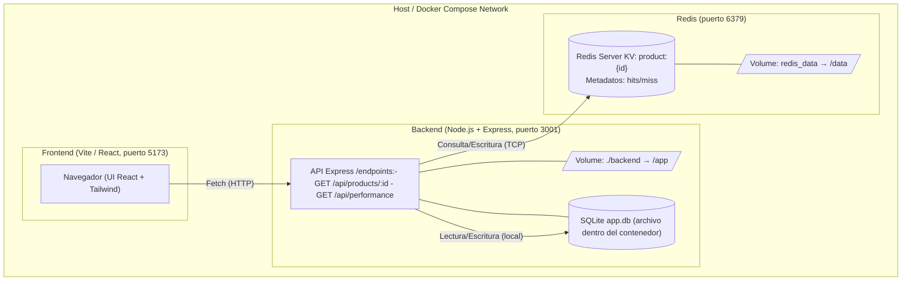

# 🧠 Demo – Patrón Cloud: Cache-Aside con Redis  

**Curso:** Arquitectura de Software  
**Alumno:** Hideki Sotero Huaroto  
**Profesor:** José Caballero Ortiz  
**Patrón seleccionado:** *Cache-Aside Pattern*  
**Fuente principal:** [Microsoft Cloud Design Patterns – Cache-Aside](https://learn.microsoft.com/en-us/azure/architecture/patterns/cache-aside)

---

## 1. Descripción del Patrón  

El **patrón Cache-Aside** (o *Lazy Loading*) es una estrategia de almacenamiento en caché que busca **reducir la carga sobre la base de datos** y **mejorar el rendimiento** de acceso a datos.

En este patrón, la aplicación:
1. **Verifica primero en la caché** (por ejemplo, Redis) si los datos existen.  
2. Si existen (**cache hit**), los devuelve directamente.  
3. Si no existen (**cache miss**), consulta la **base de datos** y luego almacena el resultado en la caché para futuras solicitudes.  

Redis se usa como **capa intermedia de acceso rápido** (in-memory) para disminuir la latencia y el consumo de recursos del motor de base de datos subyacente (en este caso, SQLite3).

---

## 2. Diseño de la Solución

```text
┌──────────────────────────────┐
│         Frontend (Vite)      │
│ React + TypeScript + Tailwind│
│  - Búsqueda de producto      │
│  - Visualización del origen  │
│  - Métricas de rendimiento   │
└──────────────┬───────────────┘
               │
               ▼
┌──────────────────────────────┐
│     Backend Node.js (Express)│
│  - Endpoints REST /api/*     │
│  - Implementación Cache-Aside│
└──────────────┬───────────────┘
               │
               ▼
┌──────────────────────────────┐
│         Redis (Cache)        │
│  - GET / SETEX / EXPIRE      │
│  - TTL automático (1h)       │
│  - Métricas de hits/misses   │
└──────────────────────────────┘
               │
               ▼
┌──────────────────────────────┐
│     SQLite3 (Base de datos)  │
│  - Catálogo de productos     │
│  - Fuente de verdad          │
└──────────────────────────────┘
```
---

## 3. Funcionalidades Implementadas

| Componente                             | Descripción                                                                                                                      |
| -------------------------------------- | -------------------------------------------------------------------------------------------------------------------------------- |
| **Frontend (React + Vite + Tailwind)** | Interfaz para buscar productos por ID, visualizar si la respuesta viene de *Redis* o *DB*, y monitorear métricas de rendimiento. |
| **Backend (Node + Express)**           | Implementa la lógica Cache-Aside, usando `ioredis` para conectar con Redis y `better-sqlite3` para leer datos de una base local. |
| **Redis**                              | Guarda en caché los productos consultados junto con un tiempo de vida (TTL).                                                     |
| **SQLite3**                            | Base de datos ligera con una tabla `products` que contiene el catálogo inicial.                                                  |

---

## 4. Flujo del Patrón Cache-Aside

1. El usuario busca un producto ingresando su ID.
2. El backend ejecuta:
   - GET product:{id} en Redis.
   - Si existe → CACHE HIT → devuelve desde Redis.
   - Si no existe → CACHE MISS → lee desde SQLite → guarda con SETEX.
3. Redis almacena los datos durante el TTL configurado (por defecto 1 hora).
4. El frontend muestra visualmente si el origen fue “CACHE” o “DATABASE”.
5. La métrica de rendimiento muestra:
  - Tiempo de respuesta de Redis.
  - Contadores de hits/misses.
  - Ratio de aciertos en caché.

---

## 5. Ejemplo de Endpoints

| Método | Endpoint            | Descripción                                                 |
| ------ | ------------------- | ----------------------------------------------------------- |
| `GET`  | `/api/products/:id` | Obtiene un producto aplicando el patrón Cache-Aside.        |
| `GET`  | `/api/performance`  | Devuelve métricas: tiempos, hits/misses, ratio y timestamp. |

### Ejemplo de respuesta (/api/products/1)

```json
{
  "source": "cache",
  "ttlSeconds": 3550,
  "data": {
    "id": 1,
    "name": "Camisa Oxford Azul",
    "price": 129.9,
    "stock": 12,
    "image_url": "https://images.unsplash.com/photo-1520975693410-001d22b5435f",
    "updated_at": "2025-11-01T18:30:24.000Z"
  }
}
```

### Ejemplo de métricas (/api/performance)

```json
{
  "timestamp": "2025-11-02T21:00:12.554Z",
  "redisResponseTimeMs": 0.86,
  "dbResponseTimeMs": 2.37,
  "cache": {
    "hit": 12,
    "miss": 3,
    "hitRatio": 0.8
  }
}
```

---

## 6. Instrucciones de Instalación

### Backend

```bash
cd backend
npm install
```

### Inicializar base de datos

```bash
npm run seed
```

### Iniciar Redis con Docker

```bash
docker run --name redis-cache -p 6379:6379 -d redis
```

### Ejecutar backend

```bash
npm run dev
```

Por defecto se iniciará en http://localhost:3001

### Frontend

```bash
cd frontend
npm install
npm run dev
```

Abre en el navegador http://localhost:5173

## 7. Ejemplo visual

**Interfaz principal:**
- Campo de búsqueda por ID.
- Resultado con datos del producto y etiquetas:
  - 🟢 “CACHE HIT” → proviene de Redis.
  - 🟣 “DATABASE” → proviene de SQLite.
- Panel de métricas que muestra en tiempo real:
  - Tiempo de respuesta de Redis.
  - Hits / Misses acumulados.
  - Porcentaje de aciertos

## 8. Diagrama de contenedores de la demo



## 9. Resultados Observados

| Atributo de Calidad | Descripción                                                                           |
| ------------------- | ------------------------------------------------------------------------------------- |
| **Rendimiento**     | Reducción drástica del tiempo de respuesta (<1 ms para Redis vs. ~3–10 ms en SQLite). |
| **Escalabilidad**   | Redis permite atender múltiples clientes sin recargar la base de datos.               |
| **Disponibilidad**  | TTL automático evita saturación y mantiene datos frescos.                             |
| **Mantenibilidad**  | Código modular: cada capa (frontend, backend, cache, DB) desacoplada.                 |

## 10. Conclusión
El patrón Cache-Aside permite optimizar el rendimiento y la eficiencia en arquitecturas distribuidas mediante la carga diferida de datos en la caché.
En esta demo se evidencia cómo Redis actúa como una capa de acceso ultrarrápido, reduciendo las lecturas en base de datos y mejorando los tiempos de respuesta.
Este enfoque resulta ideal para aplicaciones e-commerce o catálogos donde los datos cambian poco pero se consultan frecuentemente.

## 11. Referencias
- Microsoft Azure Architecture Center (2024). Cache-Aside Pattern.
https://learn.microsoft.com/en-us/azure/architecture/patterns/cache-aside
- Redis Labs (2024). Redis Documentation. https://redis.io/docs
- Bass, L., Clements, P., & Kazman, R. (2013). Software Architecture in Practice. Addison-Wesley.


