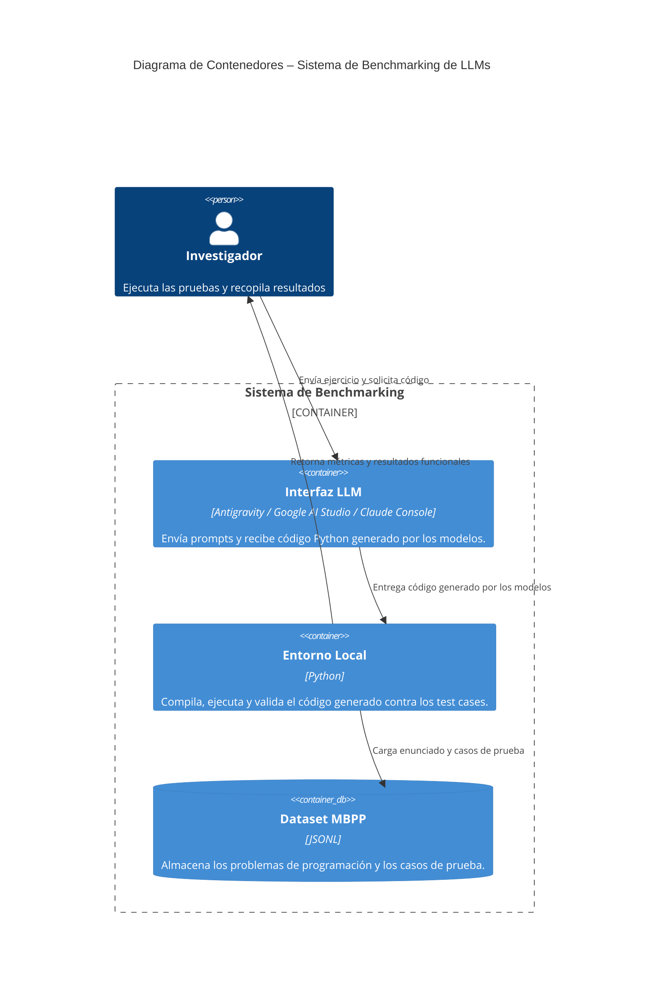

> [0. Acerca del Grupo](../../0.md) › [0.8. Temas Individuales (Parte 2)](../0.8.md) › [0.8.3. Integrante 3](0.8.3.md)

# 0.8.3. Integrante 3 – Evaluación Comparativa de Modelos LLM en Tareas de Programación

**Nombre:** Luis Mario Martinez Rueda  
**Curso:** Arquitectura de Software  
**Docente:** Jose Caballero Ortiz   
**Tema:** Benchmarking de LLMs para Generación de Código  

---

## 1. Problema

Los modelos de lenguaje (LLMs) se utilizan cada vez más para **asistir en la generación automática de código**, tanto en contextos educativos como profesionales.  
Sin embargo, evaluar su rendimiento es complejo debido a:

- Diferencias en calidad del código generado.  
- Variaciones en tiempos de respuesta (latencia).  
- Resultados inconsistentes en ejecuciones repetidas.  
- Falta de un estándar unificado para comparar modelos.  

Para tomar decisiones informadas sobre qué modelo utilizar, se requiere un **benchmark controlado**, que mida objetivamente la capacidad real de los LLMs para resolver ejercicios de programación.

---

## 2. Enfoque de Solución – Benchmarking de LLMs

El objetivo del proyecto es crear un **proceso de evaluación manual** para comparar LLMs en la generación de código Python, aplicando métricas simples, reproducibles y extraídas de literatura académica.

### Modelos evaluados:

| Modelo | Plataforma | Tipo |
|--------|------------|------|
| **Gemini 3 Pro Preview** | Google AI Studio | LLM general razonador |
| **Claude 4.5 Sonnet** | Anthropic | LLM optimizado para tareas complejas |

### Dataset utilizado:

Se utilizó un subconjunto de 5 problemas del dataset **MBPP (Mostly Basic Python Problems)**, un dataset ampliamente referenciado en papers de benchmarking.

Cada problema incluye:

- Enunciado  
- Código base o firma de función  
- Casos de prueba  
- Output esperado  

---

## 3. Métricas Seleccionadas

Basadas en estudios académicos sobre evaluación de LLMs para generación de código (Scopus, IEEE, ACL), se emplearon tres métricas:

| Métrica | Descripción |
|---------|-------------|
| **EXEC (0/1)** | Indica si el código generado se ejecuta sin errores. |
| **TESTS OK / TESTS TOTALES** | Cantidad de casos de prueba superados. |
| **FUNC (%)** | Ratio de éxito funcional (tests_ok / tests_totales × 100). |
| **LAT (s)** | Tiempo que tardó el modelo en generar su respuesta. |

Estas métricas permiten evaluar **exactitud funcional**, **robustez del código** y **eficiencia temporal** del modelo.

---

## 4. Proceso Experimental

El experimento consistió en un flujo manual estandarizado:

1. Seleccionar un ejercicio del dataset MBPP.  
2. Mostrar al modelo el prompt correspondiente.  
3. Recibir únicamente código Python sin explicaciones.  
4. Ejecutar el código localmente.  
5. Registrar si ocurre error de ejecución.  
6. Ejecutar los 3 casos de prueba del ejercicio.  
7. Registrar métricas.  
8. Repetir con el siguiente modelo.  

Para facilitar la interacción, se utilizó un **agente en Antigravity (Google)** que permite enviar prompts y obtener respuestas consistentes.

---

## 5. Arquitectura del Proceso de Benchmarking

---

## 6. Tabla Comparativa de Resultados

| Task ID | Ejercicio | Modelo | EXEC | Tests OK | Totales | FUNC (%) | LAT (s) |
|--------|-----------|--------|------|----------|----------|------------|-----------|
| 1 | min_cost | Gemini | 1 | 3 | 3 | 100 | 15.55 |
| 1 | min_cost | Claude | 1 | 3 | 3 | 100 | 10.14 |
| 2 | similar_elements | Gemini | 1 | 3 | 3 | 100 | 14.71 |
| 2 | similar_elements | Claude | 1 | 3 | 3 | 100 | 7.75 |
| 3 | is_not_prime | Gemini | 1 | 3 | 3 | 100 | 20.46 |
| 3 | is_not_prime | Claude | 1 | 3 | 3 | 100 | 7.85 |
| 4 | heap_queue_largest | Gemini | 1 | 3 | 3 | 100 | 14.51 |
| 4 | heap_queue_largest | Claude | 1 | 3 | 3 | 100 | 8.26 |
| 5 | count_ways | Gemini | 1 | 3 | 3 | 100 | 16.53 |
| 5 | count_ways | Claude | 1 | 3 | 3 | 100 | 9.82 |

---

## 7. Interpretación de Resultados

### Exactitud funcional
Ambos modelos cumplen el 100% de los casos en los 5 ejercicios.  
Esto indica:

- Alto dominio de patrones clásicos de programación.  
- Correcta interpretación del problema y los constraints.  
- Capacidad sólida para generar código ejecutable.  

### Latencia
Aquí se encuentra la **única diferencia práctica observable**:

- **Claude 3.5 Sonnet** es consistentemente más rápido (entre 7–10 s).  
- **Gemini 3 Pro Preview** tiene latencias mayores (14–20 s).  

Esto sugiere que Claude está más optimizado para *code generation* en su modo actual.

---

## 8. Demo

La demostración del proyecto incluye:

- Ejecución del proceso completo de evaluación.  
- Uso del agente Antigravity para enviar prompts.  
- Verificación manual del código generado.  
- Visualización de la tabla comparativa.  

---

## 9. Conclusión

- Ambos modelos producen **código funcional, correcto y sin errores** para los 5 ejercicios evaluados.  
- Claude ofrece una **latencia significativamente menor**, lo que lo hace más eficiente en tareas interactivas o escenarios con requerimientos de baja espera.  
- La metodología propuesta es **simple, manual y reproducible**, ideal para evaluaciones controladas con recursos limitados.  
- Este benchmark demuestra que los LLMs actuales pueden resolver tareas de programación básica con **alta fiabilidad**, abriendo paso a estudios más amplios en problemas complejos.

---

## Video del Proyecto

**El siguiente enlace dirige al video donde se explica el desarrollo e implementación del Benchmarking de LLMs para Generación de Código”.**  
- [https://www.youtube.com/watch?v=T1XbBlN6UqE](https://www.youtube.com/watch?v=T1XbBlN6UqE)

---
[⬅️ Anterior](../0.8.2/0.8.2.md) | [🏠 Home](../../../README.md) | [Siguiente ➡️](../0.8.4/0.8.4.md)