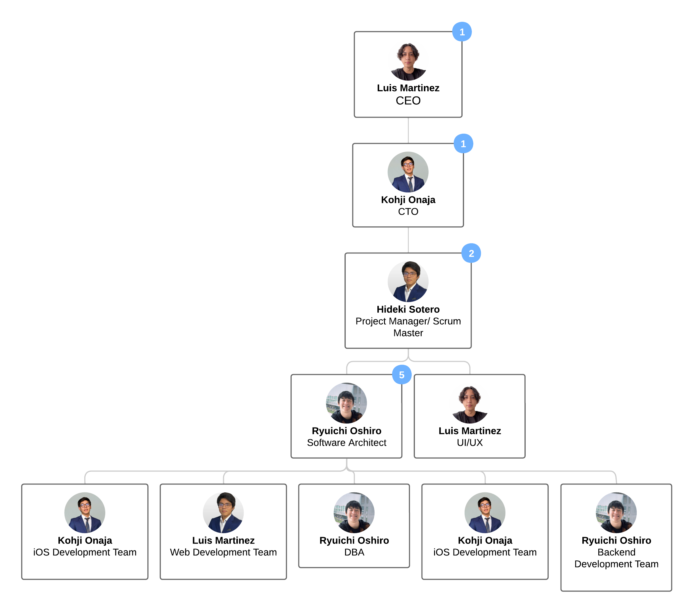

# 1.3. Estructura del Equipo

## Documentación del Organigrama de Equipo

### 1. Estructura General
La organización cuenta con un **CEO** encargado de la visión del negocio y un **CTO** responsable de la estrategia tecnológica.  
Bajo el CTO se distribuyen los equipos de desarrollo: **iOS, Android, Web y Backend**.  

Actualmente, por estructura de equipo reducida, algunos puestos especializados que estaban pendientes de contratación están siendo **cubiertos internamente**:  
- El **Equipo Web** también se encarga de **UI/UX**.  
- El **Equipo Backend** también cubre funciones de **Arquitectura de Software** y **DBA**.  
- **Hideki Sotero (Android Developer)** cumple doble rol como **Project Manager / Scrum Master**.  

---

### 2. Organigrama

---
### 3. Puestos Abiertos (Pendientes de Contratación)

Aunque las funciones están siendo cubiertas temporalmente por miembros actuales, se recomienda contratar especialistas dedicados para:

| Cargo                     | Rol (Catálogo)   | Situación Actual                                                   |
|----------------------------|------------------|----------------------------------------------------------------------|
| UX/UI Designer             | Diseñador        | Funciones actualmente cubiertas por el equipo Web.                   |
| Project Manager / Scrum Master | Jefe de Proyecto | Funciones actualmente cubiertas por Hideki Sotero (Android Dev).     |
| Software Architect         | Arquitecto       | Funciones actualmente cubiertas por el equipo Backend (Ryuichi).     |
| DBA                        | DBA              | Funciones actualmente cubiertas por el equipo Backend (Ryuichi).     |
