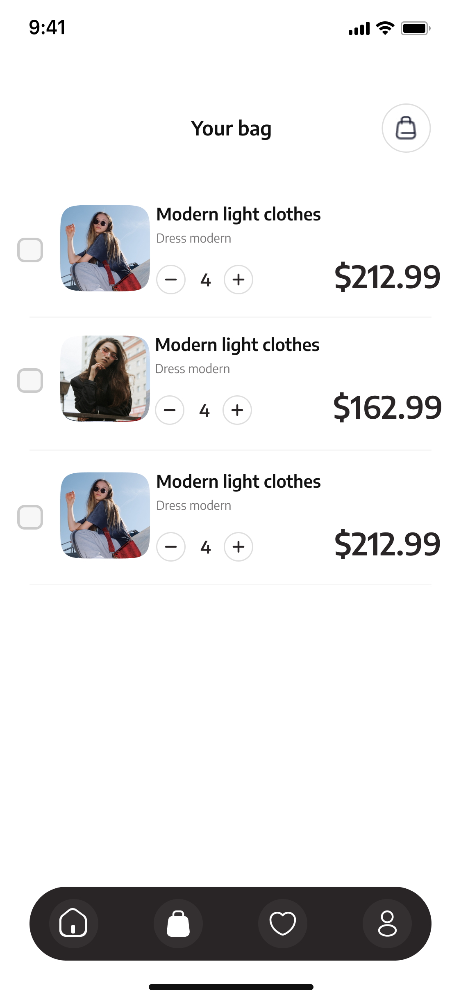
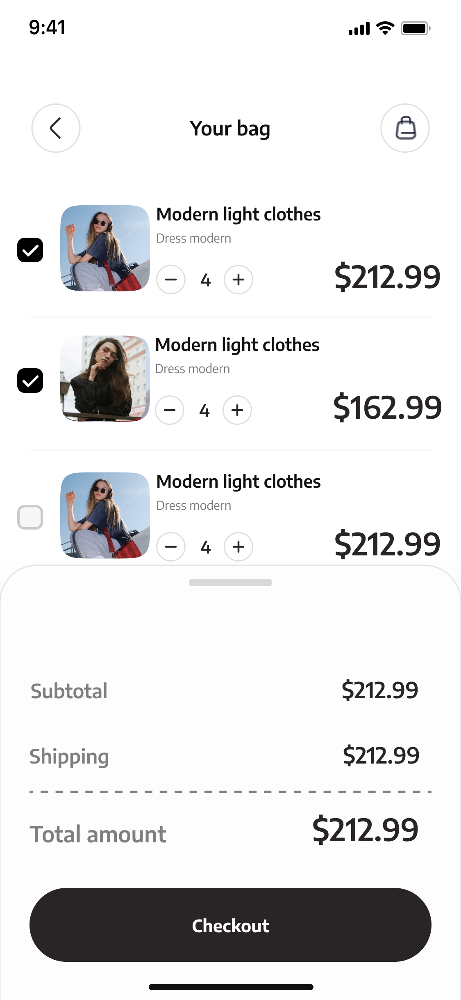
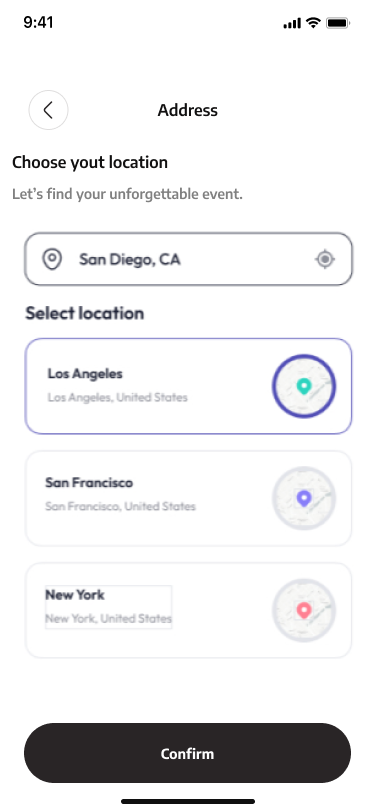
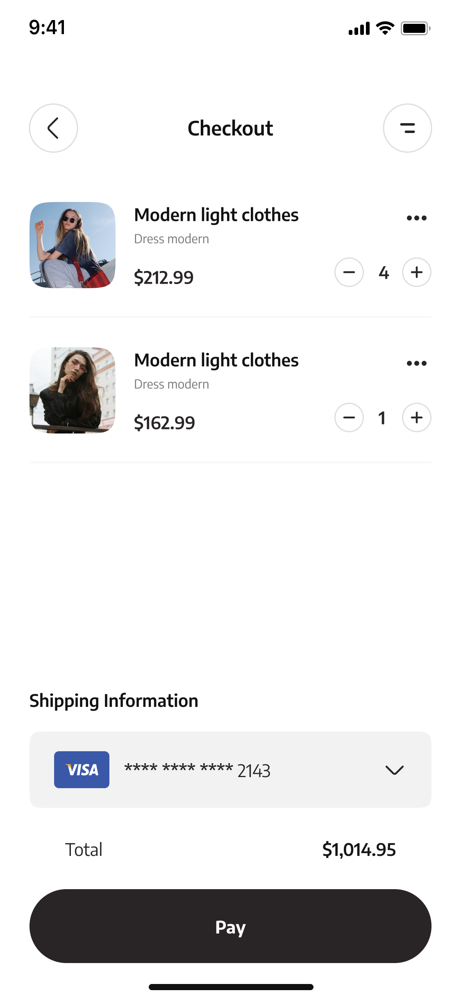

# 2.1.1. Módulo 1 – Gestión de Compras – Kohji Onaja

El módulo de **Gestión de Compras** permite a los usuarios realizar el proceso completo de adquisición de productos dentro del ecosistema de Ecommerce de Ropa.  
Abarca desde la administración del carrito, selección de dirección y método de pago, hasta la confirmación y registro de la transacción.  
Busca ofrecer una **experiencia de compra fluida, segura y confiable** en las aplicaciones móviles Android/iOS y la plataforma web.

---

## Alcance
Facilitar al cliente la compra de productos desde el catálogo, permitiéndole:
- Agregar y modificar productos en su carrito.  
- Revisar precios, costos de envío y totales.  
- Seleccionar dirección de entrega y método de pago.  
- Confirmar la compra y recibir notificación del pedido.  
- Consultar historial de compras y estados de pedido.  

El módulo se integra con:
- **Catálogo de Productos:** para verificar precios y disponibilidad.  
- **Gestión de Usuarios:** para recuperar direcciones e identidad del comprador.  
- **Pasarela de Pagos:** para procesar transacciones seguras.  
- **Gestión de Pedidos:** para almacenar, actualizar y notificar el estado del pedido.

---

## Supuestos
- El backend está implementado en **Node.js con PostgreSQL**.  
- La integración con pasarela de pagos se realiza vía **API REST** con autenticación OAuth2.  
- El flujo de pedidos está sincronizado en tiempo real con el módulo de **Inventario y Pedidos**.  
- Los pagos se procesan en moneda local (PEN).  
- La sesión del usuario está autenticada mediante JWT.

---

## Requisitos Funcionales

### RF-GC-01 Carrito de Compras
El usuario puede agregar, eliminar y modificar productos dentro de su carrito antes de finalizar la compra.  
- **Aceptación:** al agregar un producto, se refleja en el carrito con cantidad y subtotal actualizados.

---

### RF-GC-02 Cálculo de Totales
El sistema calcula automáticamente el subtotal, impuestos, envío y total general del pedido.  
- **Aceptación:** el total se actualiza en tiempo real al modificar cantidades o eliminar productos.

---

### RF-GC-03 Selección de Dirección
El usuario selecciona una dirección guardada o registra una nueva antes del pago.  
- **Aceptación:** la dirección elegida se asocia correctamente al pedido confirmado.

---

### RF-GC-04 Selección de Método de Pago
El usuario elige entre los métodos disponibles (tarjeta, billetera digital, transferencia).  
- **Aceptación:** el sistema valida el método y prepara la transacción con la pasarela configurada.

---

### RF-GC-05 Confirmación del Pedido
Al confirmar, el sistema registra el pedido y genera un número único de orden.  
- **Aceptación:** el usuario recibe una notificación visual (“Compra confirmada”) y un correo con el detalle.

---

### RF-GC-06 Procesamiento de Pago
Se realiza la transacción con la pasarela externa y se recibe la respuesta de autorización o rechazo.  
- **Aceptación:** en caso de éxito, el pedido se marca como “Pagado”; en caso de error, se muestra mensaje claro y opción de reintento.

---

### RF-GC-07 Actualización del Estado del Pedido
El estado pasa por las etapas: *Pendiente → Pagado → En preparación → Enviado → Entregado*.  
- **Aceptación:** el usuario puede consultar el estado en su historial y recibe notificaciones automáticas de cambio.

---

### RF-GC-08 Notificaciones y Confirmaciones
El sistema envía notificaciones push o correo electrónico después de la compra o en cada cambio de estado.  
- **Aceptación:** cada notificación se registra en logs con timestamp y estado de envío.

---

### RF-GC-09 Historial de Compras
El usuario puede consultar sus pedidos previos con detalles (fecha, monto, productos, estado).  
- **Aceptación:** se muestran los últimos 12 pedidos y opción para cargar más.

---

### RF-GC-10 Cancelaciones y Devoluciones
El usuario puede solicitar cancelación antes del envío o devolución dentro del plazo permitido.  
- **Aceptación:** el sistema registra la solicitud, actualiza el estado del pedido y genera un ticket para atención.

---

### RF-GC-11 Auditoría y Registro
Todos los eventos (creación de pedido, pago, cambio de estado) se registran con trazabilidad completa.  
- **Aceptación:** cada registro incluye `order_id`, `user_id`, `timestamp`, `status` y `source`.

## Restricciones
- El módulo de **Gestión de Compras** deberá integrarse con la **pasarela de pagos seleccionada (Izipay o Culqui)** mediante API REST segura.  
- Solo se permiten compras en moneda **PEN** en esta primera versión.  
- El flujo de confirmación debe funcionar con **autenticación obligatoria (JWT)**.  
- La base de datos de pedidos y transacciones residirá en **PostgreSQL**.  
- El backend compartirá infraestructura con otros módulos, sin autoescalado dinámico inicial.  
- Se deberán cumplir las **normas de protección de datos personales (GDPR / Ley local)**.  
- La interfaz debe seguir las **guías de diseño UX/UI del proyecto** y estar alineada con el flujo del carrito y catálogo.

---
## **Vistas Relacionadas**

A continuación se muestran las principales pantallas del **Módulo de Gestión de Compras**, que reflejan el flujo completo de compra desde el carrito hasta el pago final.  
Cada vista fue diseñada para mantener una experiencia clara, moderna y coherente con el ecosistema del Ecommerce de Ropa.

---

### **1. Carrito de Compras (Your Bag)**
Permite al usuario visualizar los productos agregados, modificar cantidades o eliminar ítems antes de proceder al pago.  
Esta vista corresponde al requisito **RF-GC-01 (Carrito de Compras)** y **RF-GC-02 (Cálculo de Totales)**.

---

### **2. Resumen del Carrito con Totales**
Muestra el **subtotal**, **costo de envío** y **total general** del pedido.  
Desde esta vista el usuario puede continuar hacia el proceso de pago.  
Relacionada con **RF-GC-02 (Cálculo de Totales)** y **RF-GC-05 (Confirmación del Pedido)**.

---

### **3. Selección de Dirección de Envío**
Permite elegir o registrar una dirección antes de proceder con el pago.  
Incluye una lista de ubicaciones predefinidas y campo de búsqueda.  
Cumple con el requisito **RF-GC-03 (Selección de Dirección)**.

---

### **4. Pantalla de Pago (Checkout)**
Muestra el detalle de los productos seleccionados, el método de pago activo y el total final antes de confirmar la compra.  
Cumple con los requisitos **RF-GC-04 (Selección de Método de Pago)** y **RF-GC-06 (Procesamiento de Pago)**.

---

Cada una de estas vistas forma parte del flujo principal del módulo de compras y se encuentra conectada con los servicios de backend para mantener la información del carrito, dirección, pago y estado del pedido en tiempo real.
