# 2.1.2. Módulo 1 - Autenticación y Usuarios - Ryuichi Ugamoto

Este módulo se encarga de gestionar el acceso seguro al sistema y sus APIs, permitiendo el registro e inicio de sesión de usuarios, administración de roles y permisos, validación de tokens y recuperación de credenciales. Además, asegura que solo usuarios autorizados puedan acceder a los recursos, protegiendo la integridad y confidencialidad de la información.  

---

## Requisitos Funcionales

### 1. Registro de usuarios
- El sistema debe permitir el **registro de usuarios** validando la unicidad del correo electrónico.

**Captura Registro de Usuario Fallido en Swagger:**
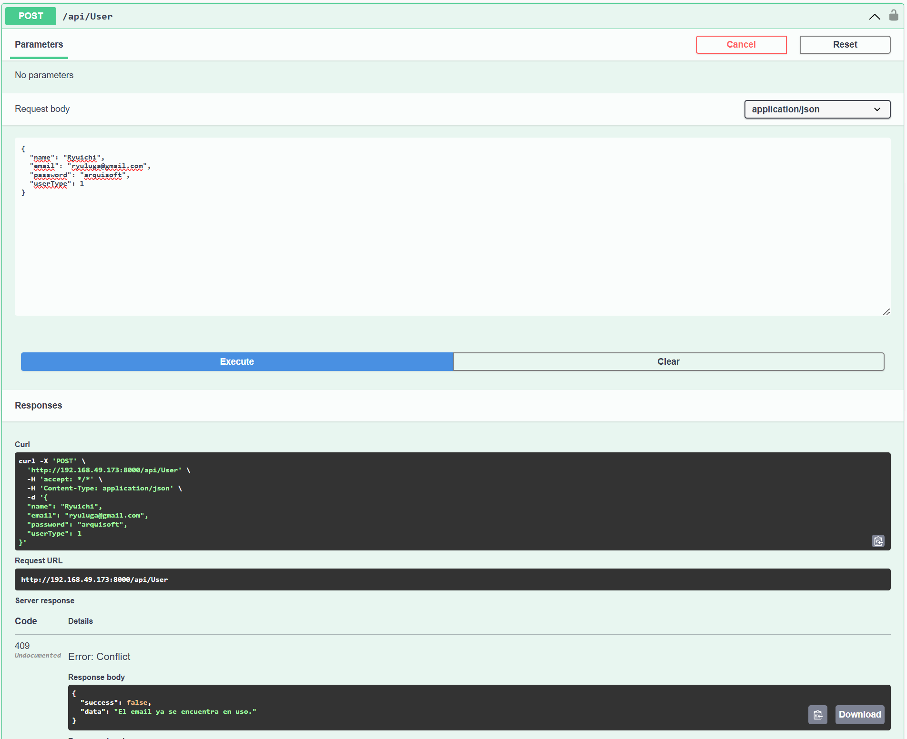

**Captura Registro de Usuario Exitoso en Swagger:**
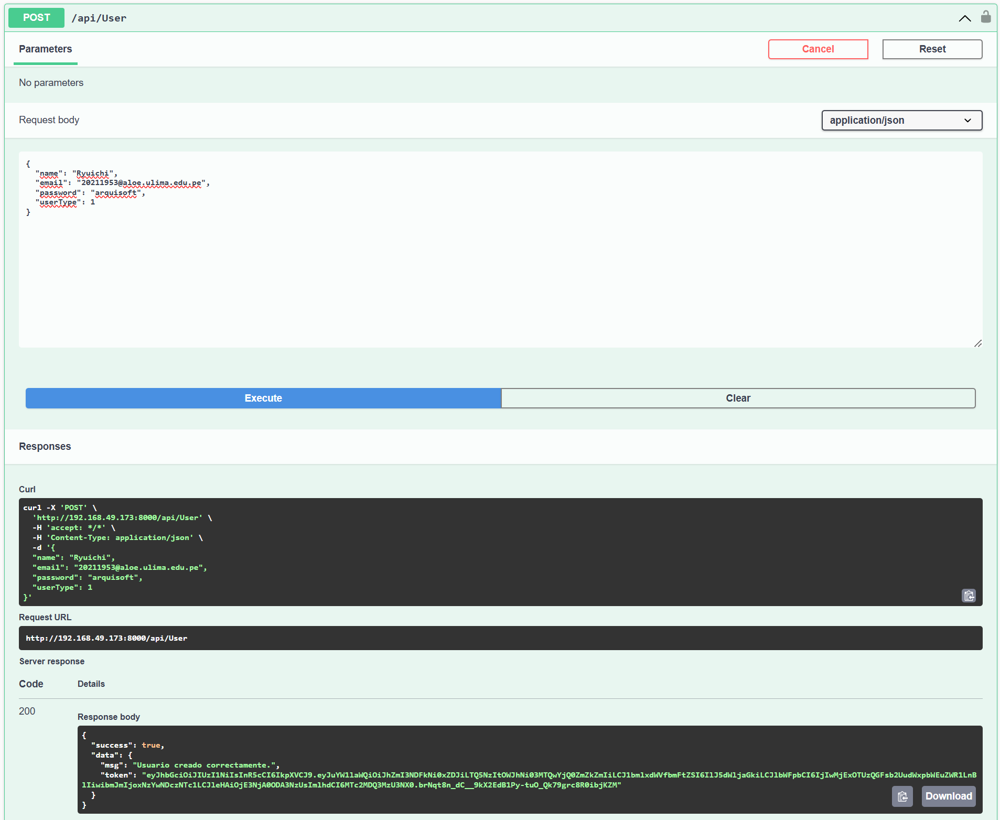

---

### 2. Inicio de sesión seguro
- El sistema debe permitir el **inicio de sesión seguro** mediante credenciales y emitir un **token de acceso (JWT u OAuth2)**.  

**Captura de Inicio de Sesión en Swagger (La imágen muestra el primer proceso de login. Luego se traslada a MFA y recién retorna el token.):**
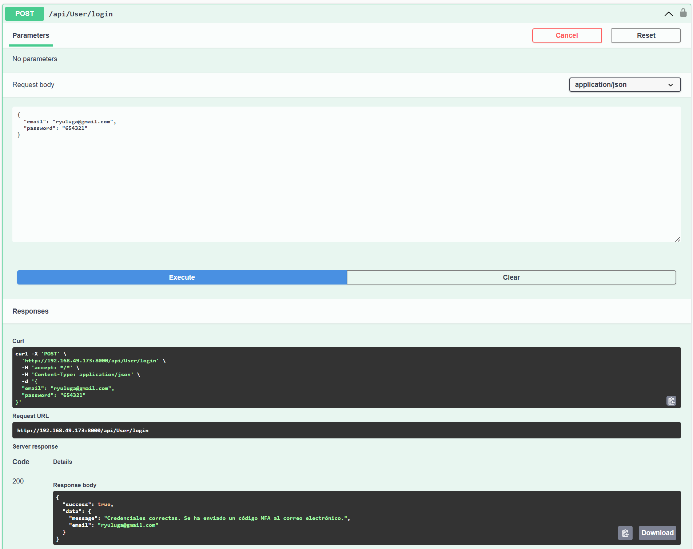

---

### 3. Refresco de tokens
- El sistema debe implementar un **mecanismo de refresco de tokens** para renovar sesiones sin necesidad de reingreso de credenciales.  

**Captura de Refresco de Tokens en Swagger:**
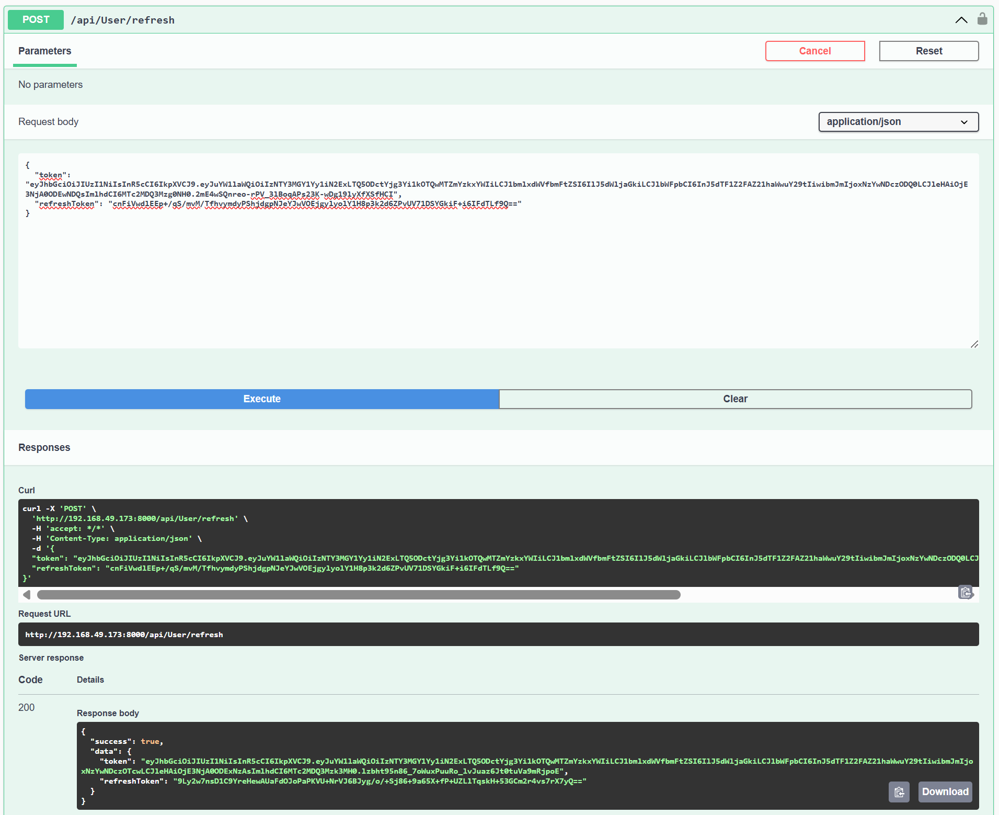

---

### 4. Reestablecimiento de contraseña
- El sistema debe permitir la **Reestablecimiento de contraseña** mediante el envío de un correo electrónico seguro.  

**Captura de Envío de Correo en Swagger:**
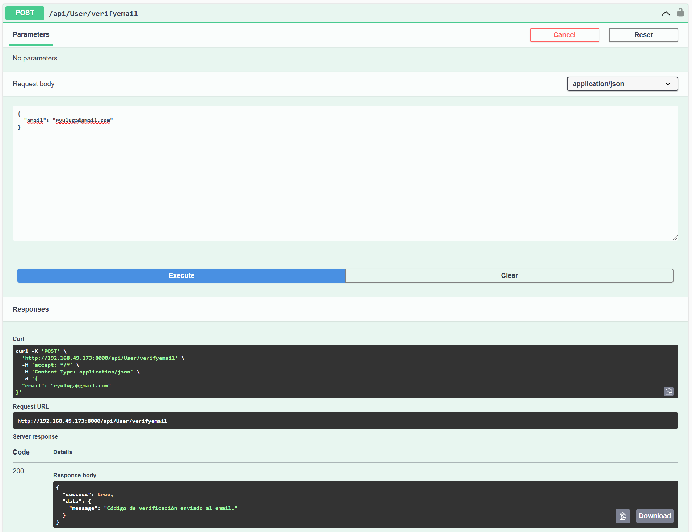

**Captura de Correo Recibido en Gmail:**
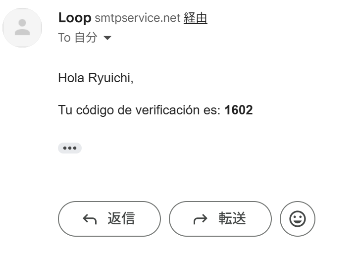

**Captura de Reestablecimiento de contraseña en Swagger:**
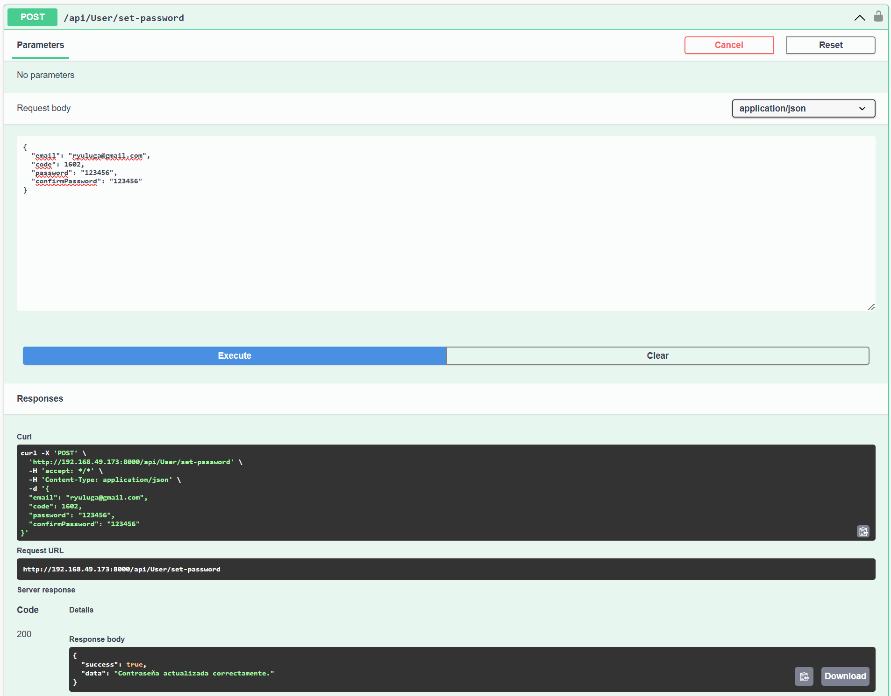

---

### 5. Roles y permisos
- El sistema debe gestionar **roles y permisos** para diferenciar accesos de usuarios y administradores.  

**Captura de Roles y permisos en Visual Studio Code:**
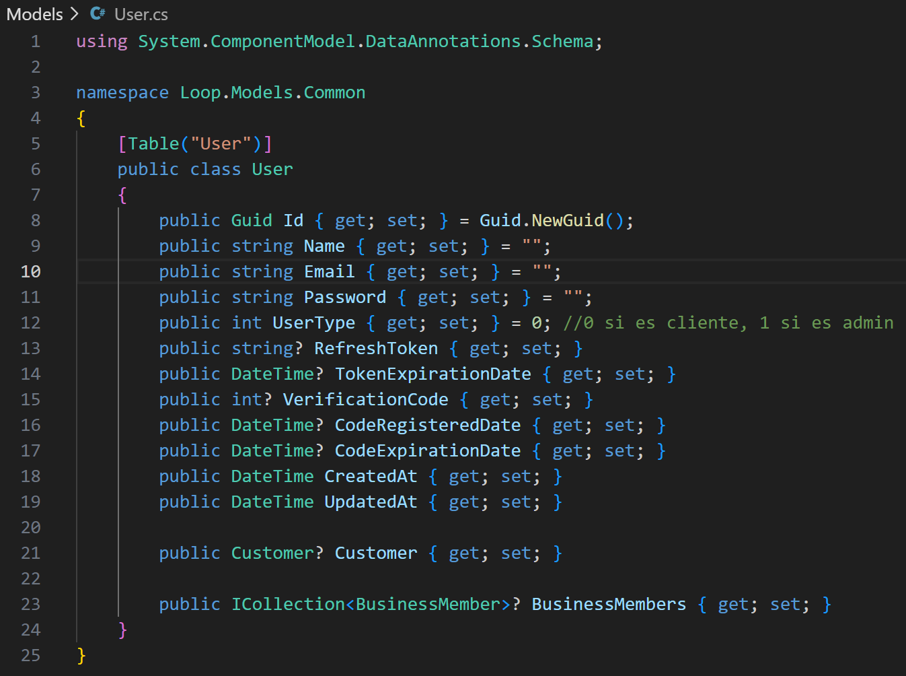

---

### 6. Validación de tokens
- El sistema debe **validar tokens en cada petición** realizada a las APIs protegidas.  

**Captura de Validación de Tokens en Swagger:**
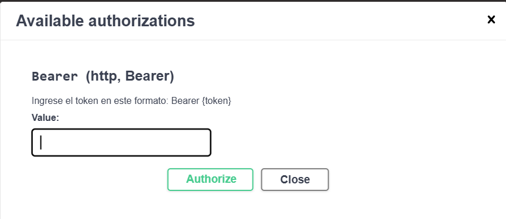

---

### 7. Logs de auditoría
- El sistema debe registrar en **logs de auditoría** todos los intentos de inicio de sesión (exitosos y fallidos).  

**Captura de Logs de Auditoría en Swagger:**
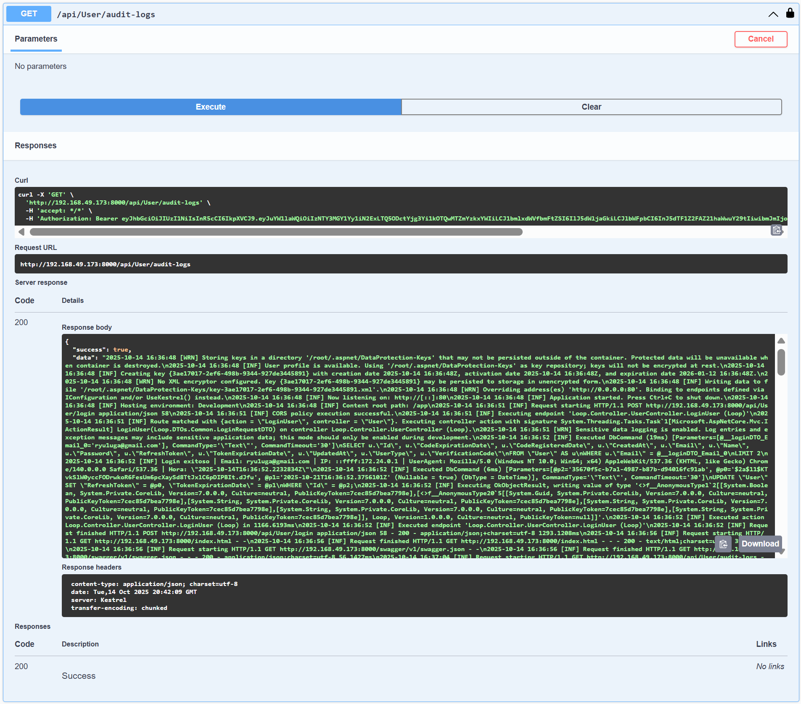

---

### 8. Autenticación multifactor (MFA)
- El sistema debe ofrecer soporte para **autenticación multifactor (MFA)** como medida adicional de seguridad.

**Captura de MFA en Swagger:**
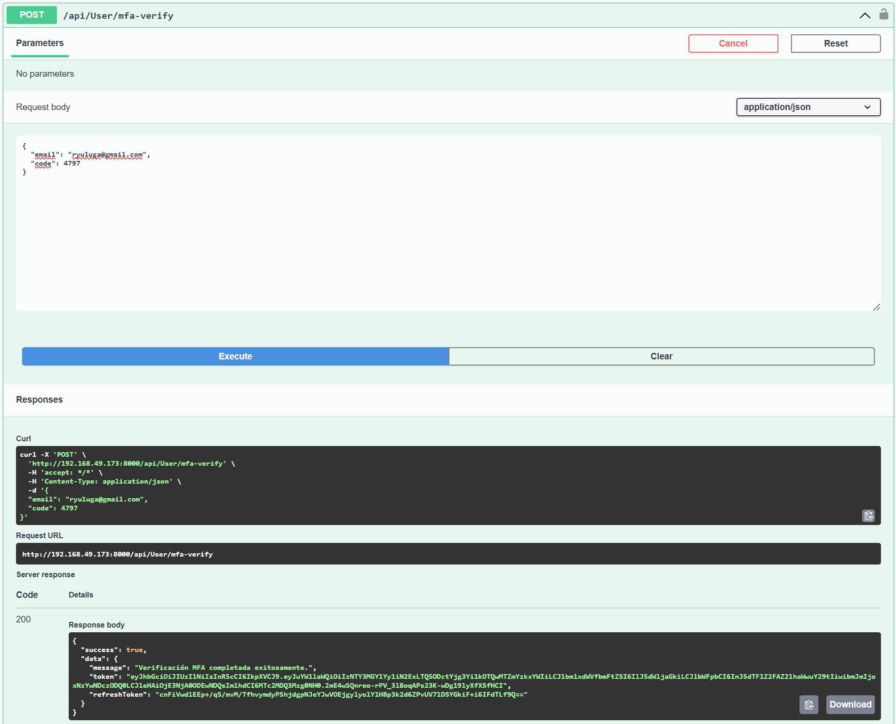