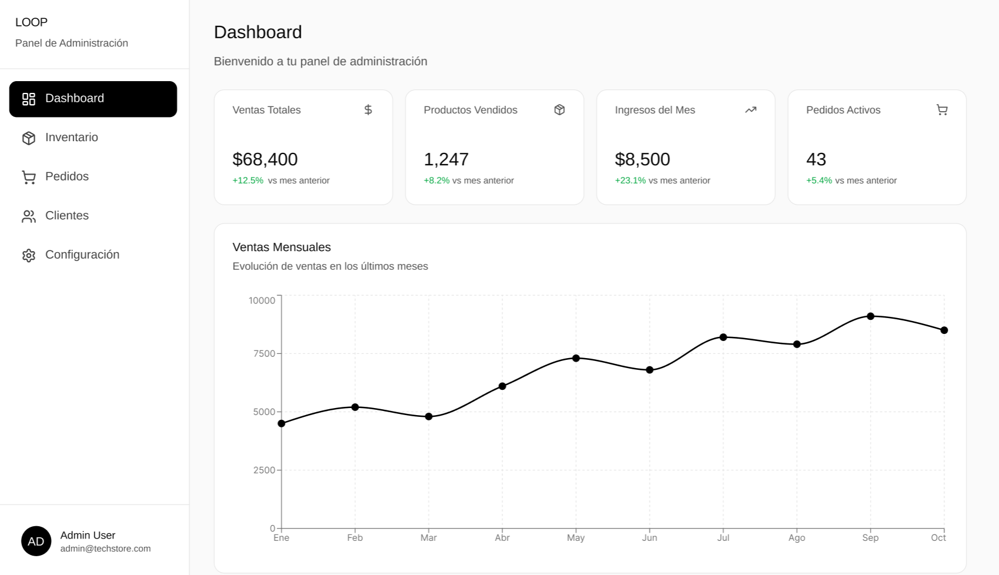
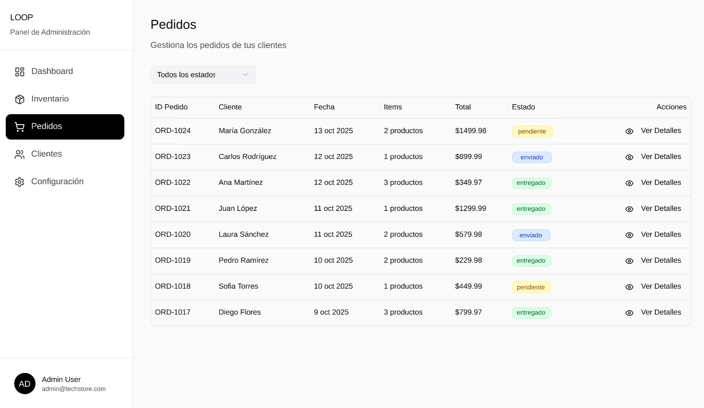
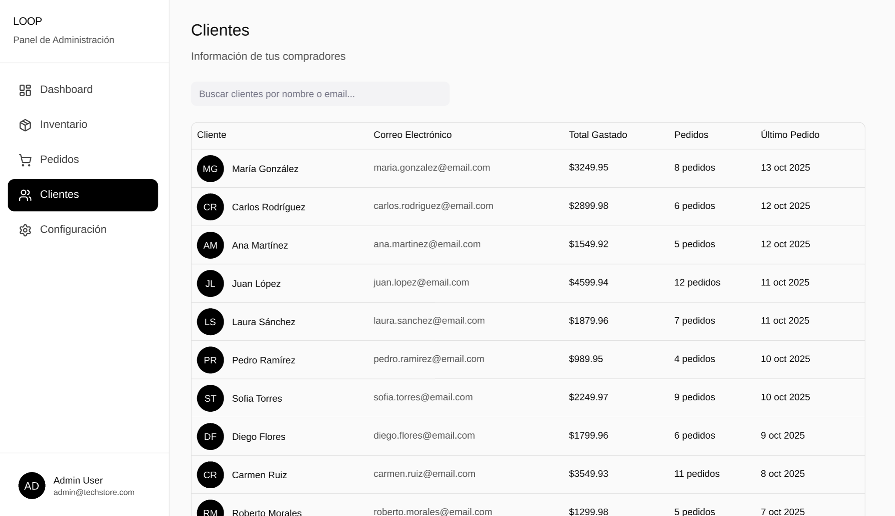
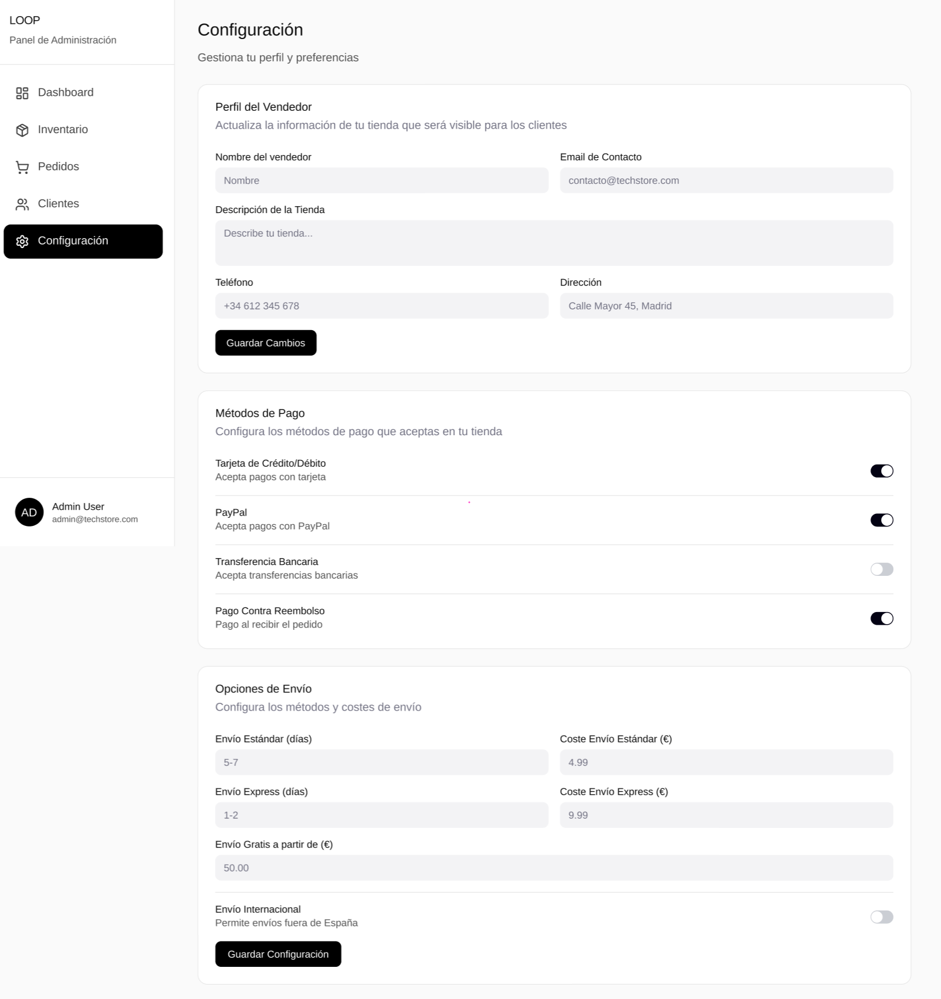

# 2.1.3. Módulo 3 - Gestión de Negocio - Luis Martinez

Este módulo centraliza las operaciones estratégicas del emprendimiento de ropa, brindando a los administradores una vista completa del rendimiento del negocio. A través del panel de control, se gestionan productos, pedidos, inventario y reportes de ventas. Además, permite visualizar métricas clave como ventas totales, ingresos del mes y evolución mensual, facilitando la toma de decisiones informadas.  

---

## Requisitos Funcionales

### 1. Visualización de ventas mensuales
- El sistema debe permitir la **visualización gráfica de las ventas mensuales**, mostrando la evolución del negocio durante los últimos meses.  
- Debe incluir un gráfico de líneas interactivo.

**Captura de Gráfico de Ventas Mensuales:**  

---

### 2. Gestión de inventario
- El sistema debe permitir **gestionar el inventario de productos**, mostrando nombre, stock, precio y categoría.  
- Se deben habilitar opciones para editar o eliminar productos desde la interfaz.  

**Captura de Vista de Inventario:**  

---

### 3. Gestión de pedidos
- El sistema debe permitir **consultar y actualizar pedidos**, incluyendo cliente, estado y monto total.  
- Se deben gestionar estados como *pendiente*, *en proceso*, *enviado* y *entregado*.  

**Captura de Vista de Pedidos:**  

---

### 4. Gestión de clientes
- El sistema debe permitir **visualizar la lista completa de clientes registrados**, mostrando información relevante como nombre, correo electrónico, número de pedidos y estado de cuenta.  
- El administrador podrá **buscar, filtrar y ordenar clientes** según distintos criterios (nombre, cantidad de compras, fecha de registro, etc.).  
- Se debe permitir **acceder al detalle de cada cliente**, incluyendo historial de pedidos, montos totales y comportamiento de compra.  
- El sistema debe ofrecer la opción de **actualizar el estado del cliente** (activo, inactivo o bloqueado) según su comportamiento o solicitudes.  

**Captura de Vista de Clientes:**  

---
### 5. Configuración de tienda
- El sistema debe permitir **configurar la información general del vendedor**, incluyendo nombre, descripción de la tienda, correo de contacto, teléfono y dirección.  
- El administrador podrá **gestionar los métodos de pago disponibles**, habilitando o deshabilitando opciones como tarjeta de crédito/débito, PayPal, transferencia bancaria o pago contra reembolso.  
- El sistema debe permitir **definir las opciones de envío**, especificando tiempos y costos para envío estándar, express e internacional, así como el monto mínimo para envíos gratuitos.  
- Los cambios realizados en esta sección deben **guardarse en tiempo real** y aplicarse automáticamente en el panel de administración.  

**Captura de Vista de Configuración de Tienda:**  

---

## Requisitos de Atributos de Calidad

| **Atributo de Calidad** | **Estímulo** | **Fuente del Estímulo** | **Artefacto** | **Entorno** | **Respuesta** | **Medida de Respuesta** |
|--------------------------|--------------|--------------------------|----------------|--------------|----------------|---------------------------|
| **Disponibilidad** | El administrador intenta acceder al panel durante un fallo temporal del servidor | Administrador | Servicio de reportes | Horario laboral | El sistema redirige a un servidor de respaldo | 99.9% de disponibilidad anual |
| **Rendimiento** | El administrador genera un reporte con más de 50,000 registros | Administrador | Backend de reportes | Operación normal | El sistema responde sin demoras perceptibles | Tiempo < 5 segundos |
| **Seguridad** | Usuario no autenticado intenta acceder al módulo | Usuario externo | Backend del módulo | Acceso remoto | El sistema bloquea el acceso y registra el intento | 100% de accesos no autorizados bloqueados |
| **Usabilidad** | Administrador nuevo intenta actualizar precios o revisar pedidos | Administrador | Interfaz de gestión web | Operación normal | La interfaz muestra flujos guiados y ayudas contextuales | Tiempo de aprendizaje < 10 min |
| **Mantenibilidad** | Se modifica la lógica de descuentos o generación de reportes | Equipo de desarrollo | Backend Node.js | Entorno de desarrollo | El cambio no afecta otros módulos | Despliegue < 1 hora |

---

## Restricciones

- El módulo deberá implementarse en **Node.js** con base de datos **PostgreSQL**.  
- Solo usuarios con **rol de administrador** podrán acceder al panel.  
- El módulo se integra con el sistema de autenticación y **no funciona como aplicación independiente**.  
