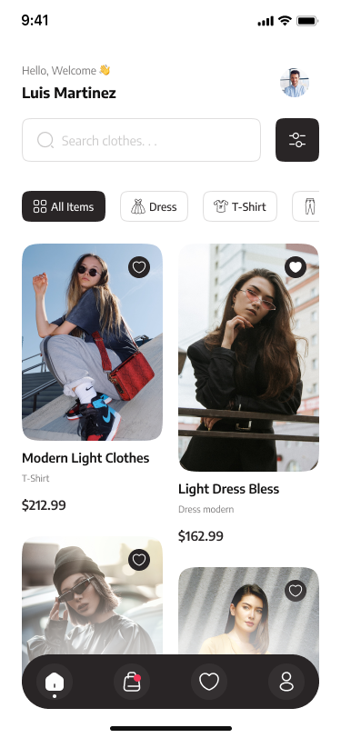

# 2.1.4. Módulo 4 - Visualización de Productos - Hideki Sotero

Este módulo se centra en ofrecer a los clientes una experiencia de navegación clara y atractiva sobre el catálogo de productos del emprendimiento de ropa. Incluye la presentación de los artículos con imágenes, descripciones, tallas, precios y disponibilidad en tiempo real, de manera que los usuarios puedan explorar y seleccionar productos de forma sencilla antes de proceder a la compra.

## Alcance
El módulo de **Visualización de Productos** constituye la capa de presentación principal para los usuarios finales, permitiendo la exploración, descubrimiento y análisis del catálogo de prendas disponibles. Su alcance abarca desde la carga inicial de productos en formato lista o cuadrícula, hasta la visualización detallada de cada artículo con sus variantes (tallas, colores, precios y stock).

Asimismo, el módulo integra funcionalidades de búsqueda avanzada, filtrado dinámico, paginación infinita, y recomendaciones personalizadas, garantizando una experiencia fluida y relevante. Incluye también capacidades de favoritos (wishlist), compartición de productos mediante enlaces directos (deep links) y una interfaz optimizada para dispositivos móviles, asegurando accesibilidad y consistencia visual en todos los contextos de uso.

El objetivo final del módulo es facilitar la decisión de compra mediante una interfaz moderna, rápida y confiable que combine información actualizada, navegación intuitiva y una presentación visual atractiva alineada con la identidad del emprendimiento.

## Supuestos
- El catálogo de productos será gestionado mediante una **API RESTful** desarrollada en **.NET C#**, que interactúa con una base de datos **PostgreSQL** para la gestión de productos, precios, stock y usuarios.
- El **frontend** será implementado utilizando **React.js**, ofreciendo una interfaz web dinámica y responsiva, con soporte completo para dispositivos móviles y escritorios.
- La API de backend gestionará las operaciones críticas de negocio, incluyendo la consulta de productos, actualización de stock en tiempo real y manejo de usuarios.
- La base de datos **PostgreSQL** se optimizará para consultas rápidas y almacenamiento eficiente, asegurando la integridad de los datos de productos y transacciones.
- Las imágenes de los productos se distribuirán a través de un **CDN**, optimizado para una carga rápida y eficiente, independientemente de la resolución de la pantalla o el tipo de dispositivo.
- La integración con servicios de telemetría y análisis (para métricas de rendimiento y uso) será implementada sin comprometer la privacidad del usuario, garantizando un cumplimiento ético de la recolección de datos.

## Requisitos Funcionales

### RF-VP-01 Listado de catálogo
El sistema muestra una grilla/lista de productos con imagen, nombre, precio, precio tachado (si aplica) y etiqueta de disponibilidad.

- **Aceptación**: dada una categoría con productos, cuando el usuario ingresa, entonces ve al menos 12 ítems iniciales y placeholders de carga.

**Tecnología involucrada**: Frontend en **React.js** consumiendo la API **.NET C#** para obtener los productos desde la base de datos PostgreSQL.

---

### RF-VP-02 Paginación / Carga incremental
La vista soporta paginación o “infinite scroll”.

- **Aceptación**: cuando el usuario llega al 80% del scroll, el sistema solicita la siguiente página y la agrega sin romper el orden.

**Tecnología involucrada**: API RESTful en **.NET C#** para manejar consultas de productos con paginación; frontend en **React.js** implementando scroll infinito.

---

### RF-VP-03 Búsqueda por texto
El usuario puede buscar por nombre, palabra clave o código.

- **Aceptación**: al escribir ≥3 caracteres y presionar Enter, la lista se actualiza; las coincidencias resaltan el término buscado.

**Tecnología involucrada**: API **.NET C#** optimizada para búsquedas por texto con **PostgreSQL**; frontend en **React.js** que actualiza dinámicamente la interfaz.

---

### RF-VP-04 Filtros dinámicos
Filtros por categoría, talla, color, rango de precio y estado (nuevo/oferta).

- **Aceptación**: al aplicar filtros múltiples, el resultado refleja la intersección; el chip de cada filtro puede removerse individualmente.

**Tecnología involucrada**: Backend en **.NET C#** para aplicar los filtros y retornar resultados optimizados; frontend en **React.js** para actualizar la interfaz en tiempo real.

---

### RF-VP-05 Ordenamiento
Orden por relevancia, precio (asc/desc) y novedades.

- **Aceptación**: al cambiar el orden, la primera página se recarga en <1.5s (p75) manteniendo filtros activos.

**Tecnología involucrada**: API **.NET C#** que maneja el orden de los productos en la base de datos PostgreSQL; frontend en **React.js** que permite la interacción en tiempo real.

---

### RF-VP-06 Detalle de producto (PDP)
Página con galería de imágenes, descripción, composición, guía de tallas, precio, variaciones, disponibilidad por variante y políticas de cambio/devolución.

- **Aceptación**: al abrir un producto válido, se muestran al menos 3 imágenes, selector de talla/color y stock por variante.

**Tecnología involucrada**: Frontend en **React.js** que solicita datos a la API **.NET C#** para obtener los detalles del producto, incluyendo imágenes y variaciones.

---

### RF-VP-07 Variantes y disponibilidad
Selección de color/talla actualiza precio, SKU y stock.

- **Aceptación**: al elegir una variante agotada, se deshabilita “Agregar al carrito” y se muestra “Sin stock” con CTA de alerta de disponibilidad (si está habilitado).

**Tecnología involucrada**: Backend en **.NET C#** para manejar las variaciones de productos y verificar la disponibilidad en tiempo real con PostgreSQL; frontend en **React.js** para actualizar la UI dinámicamente.

---

### RF-VP-08 Etiquetas y promociones
Mostrar badges como “Nuevo”, “-20%”, “Últimas unidades”, “2x1”.

- **Aceptación**: si existe una promo activa, se renderiza el badge y el precio promocional con cálculo correcto del descuento.

**Tecnología involucrada**: Backend en **.NET C#** para manejar las promociones y el descuento aplicado, interactuando con la base de datos **PostgreSQL**; frontend en **React.js** para mostrar las promociones de manera atractiva.

---

### RF-VP-09 Recomendaciones
Bloques de “Productos relacionados” y “Vistos recientemente”.

- **Aceptación**: en la PDP se presentan ≥6 recomendaciones; si no hay señales, se muestra fallback por categoría.

**Tecnología involucrada**: Backend en **.NET C#** para manejar la lógica de recomendaciones (usando datos de la base de datos y preferencias de usuario) y mostrar productos relacionados.

---

### RF-VP-10 Wishlist / Favoritos
Permite guardar/quitar productos del listado personal.

- **Aceptación**: al tocar el ícono de favorito, el estado se persiste (local + cuenta) y se refleja en todas las vistas.

**Tecnología involucrada**: Backend en **.NET C#** para almacenar los productos en la lista de favoritos del usuario; frontend en **React.js** para permitir la interacción dinámica.

---

### RF-VP-11 Compartir y Deep Link
Genera enlaces compartibles a PDP con UTM opcional.

- **Aceptación**: al usar “Compartir”, se copia la URL canónica y al abrirla aterriza directamente en la variante seleccionada (si estaba en la URL).

**Tecnología involucrada**: Backend en **.NET C#** para gestionar enlaces y parámetros UTM; frontend en **React.js** para compartir enlaces y redirigir a la PDP correcta.

---

### RF-VP-12 Accesibilidad y SEO
Soporta navegación por teclado, textos alternativos y metadatos SEO (title, meta description, Open Graph).

- **Aceptación**: elementos interactivos tienen focus-visible; imágenes tienen `alt`; la PDP define `og:image`, `og:title`, `og:description`.

**Tecnología involucrada**: Backend en **.NET C#** para generar metadatos dinámicos; frontend en **React.js** que garantiza la accesibilidad de la interfaz.

---

### RF-VP-13 Estados vacíos y errores
Mensajes claros cuando no hay resultados o hay fallo de red.

- **Aceptación**: con filtros sin coincidencias, se muestra “Sin resultados” + CTA “Limpiar filtros”; ante error 5xx, botón “Reintentar”.

**Tecnología involucrada**: Backend en **.NET C#** para gestionar errores y estados vacíos; frontend en **React.js** para mostrar mensajes claros de error y estados vacíos.

---

### RF-VP-14 Performance y placeholders
Uso de imágenes responsive, lazy-load y skeletons.

- **Aceptación**: LCP de PDP ≤ 2.5s (p75) en 4G; imágenes usan `srcset`/`sizes`; listas muestran skeleton mientras cargan.

**Tecnología involucrada**: Implementación en **React.js** para carga diferida de imágenes y uso de skeletons durante la carga.

---

### RF-VP-15 Integración con carrito
Botón “Agregar al carrito” disponible desde listado y PDP.

- **Aceptación**: al agregar, se confirma con toast y mini-cart; si faltan variaciones, se exige selección previa.

**Tecnología involucrada**: Backend en **.NET C#** para gestionar el carrito de compras; frontend en **React.js** para actualizar dinámicamente el estado del carrito.

---

### RF-VP-16 Telemetría ética
Registra (anonimizado) vistas de PDP, uso de filtros, tasa de clic en recomendaciones y add-to-cart.

- **Aceptación**: eventos incluyen `session_id` no sensible, `product_id`, `variant_id`, `category`, `price`, `currency`.

**Tecnología involucrada**: Backend en **.NET C#** para la recolección y almacenamiento de eventos de telemetría; frontend en **React.js** para gestionar los eventos de usuario.

---

### RF-VP-17 Internacionalización (opcional)
Moneda/formato de precio y tallas localizables.

- **Aceptación**: al cambiar región `PE→US`, moneda y separadores se actualizan; guía de tallas cambia a la tabla correspondiente.

**Tecnología involucrada**: Backend en **.NET C#** para manejar configuraciones regionales; frontend en **React.js** para adaptar la UI a la región seleccionada.

---

### RF-VP-18 Caching y modo offline ligero (opcional)
Cachea últimos listados y PDP para re-visitas rápidas.

- **Aceptación**: al volver a una PDP visitada, la vista aparece desde cache en <300ms y se revalida en background.

**Tecnología involucrada**: Implementación de **Service Workers** en **React.js** para el modo offline y cache de datos.

---

## Vistas Relacionadas

