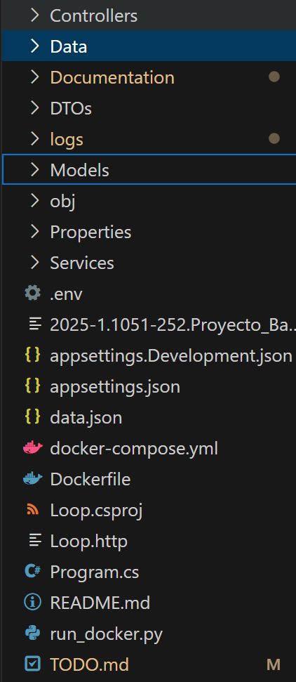
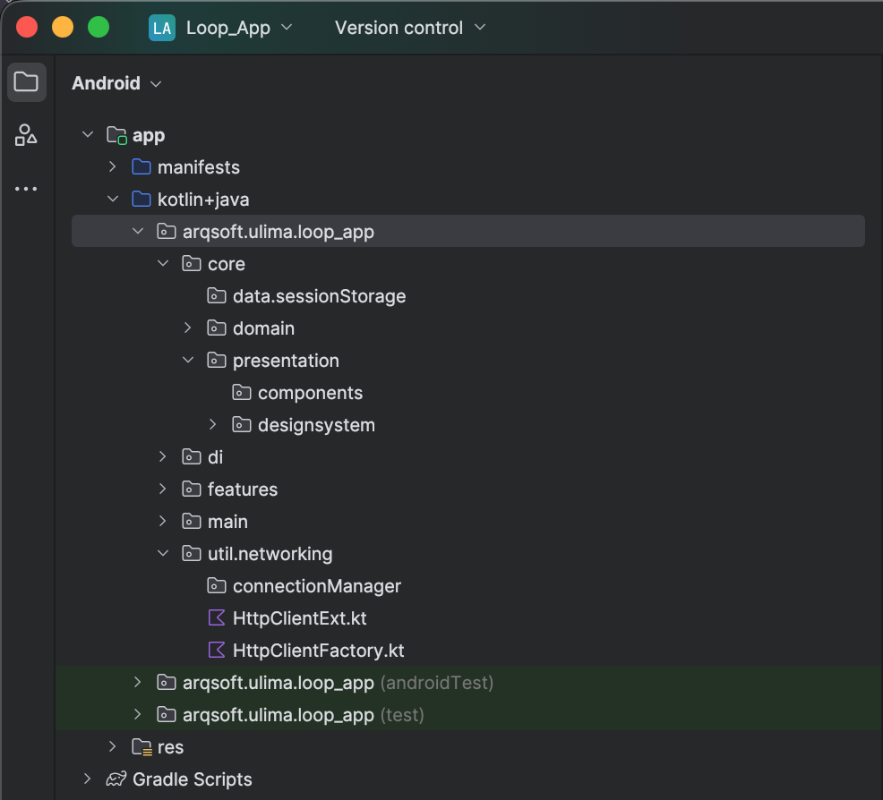

> [7. Estructura Inicial de Código](../7.md) › [7.1. Catálogo de Aplicaciones](7.1.md)

# 7.1. Catálogo de Aplicaciones

### 7.1.1. iOS (Swift) — Clean Architecture

La aplicación móvil para iOS está desarrollada en **Swift**, utilizando **SwiftUI** y **Combine**, bajo el patrón **Clean Architecture**.  
Este enfoque permite mantener un bajo acoplamiento entre capas, independencia de frameworks y alta testabilidad, siguiendo la dirección de dependencias **Presentation → Domain → Data**.

**Aplicación** | **Contenedor** | **Tecnología FE** | **Tecnología BE** | **BD (local)** | **Repositorio/Carpeta**
---|---|---|---|---|---
App iOS cliente | Mobile (iOS) | SwiftUI, Combine, MVVM | .NET API C# (REST) | UserDefaults / CoreData | `https://github.com/ulima-arqsoft/arqui252-grupo7-mobile-ios/tree/develop`

> Estructura general del proyecto en Xcode:  
> 

---

#### Estructura de carpetas

- `Loop/App/Data/` — fuentes de datos, implementación de repositorios.  
- `Loop/App/Data/Datasources/` — acceso remoto (API REST) o local (UserDefaults, CoreData).  
- `Loop/App/Data/Repositories/` — implementación concreta de interfaces del dominio.  

- `Loop/App/Domain/` — entidades, errores y casos de uso del negocio (agnósticos de framework).  
- `Loop/App/Domain/Models/` — modelos de dominio como `Cart`, `Product`, `User`.  
- `Loop/App/Domain/UseCases/` — casos de uso principales: agregar producto, eliminar item, sincronizar carrito.  

- `Loop/App/Infrastructure/` — capa técnica: red, persistencia y servicios auxiliares.  
- `Loop/App/Infrastructure/Networking/` — cliente HTTP con `URLSession`, autenticación JWT, manejo de errores.  
- `Loop/App/Infrastructure/UserDefaults/` — almacenamiento ligero de preferencias y carrito invitado.  

- `Loop/App/Presentation/` — capa de presentación (UI + ViewModels).  
- `Loop/App/Presentation/Scenes/` — vistas y pantallas (SwiftUI) organizadas por módulo:  
  - `Cart/` — gestión del carrito (RF-GC-01, RF-GC-02).  
  - `Explore/` — catálogo de productos.  
  - `Product/` — detalle de producto.  
  - `Profile/` — perfil e historial de compras (RF-GC-09).  
  - `TabView/` — navegación principal.  
- `Loop/App/Presentation/Shared/` — componentes visuales reutilizables (botones, headers, estilos).

- `Loop/App/SupportingFiles/` — recursos, assets, configuraciones.  
- `Loop/App/Info/` — metadatos del proyecto (`Info.plist`).  
- `AppDelegate.swift` / `LoopApp.swift` — punto de entrada y configuración inicial del entorno.

---

#### Decisiones técnicas principales

- **Arquitectura:** Clean Architecture + MVVM (separación estricta de UI, dominio y datos).  
- **Estado global:** `@StateObject` + `ObservableObject` para reactividad y sincronización con backend.  
- **Networking:** `URLSession` con `async/await`, encabezados `Authorization` (JWT) y `X-Request-Id`.  
- **Persistencia:** `UserDefaults` para carrito local; `CoreData` opcional para cachear catálogo y precios.  
- **Casos de uso:** definidos en *Domain*, independientes de frameworks, probados con `XCTest`.  
- **Accesibilidad:** compatibilidad con *VoiceOver* y *Dynamic Type*.  
- **Integración backend:** consumo de endpoints `/carts`, `/checkout`, `/orders` del backend .NET + PostgreSQL.

---

#### Ejemplo de correspondencia conceptual

| Capa | Función | Ejemplo |
|------|----------|----------|
| **Data** | Fuente de datos (repositorios, API, almacenamiento) | `CartRepository.swift`, `CartRemoteDataSource.swift` |
| **Domain** | Lógica de negocio, entidades y casos de uso | `AddProductUseCase.swift`, `Cart.swift` |
| **Infrastructure** | Servicios de soporte técnico | `NetworkClient.swift`, `UserDefaultsService.swift` |
| **Presentation** | UI y ViewModels | `CartView.swift`, `CartViewModel.swift` |

---

> En conjunto, esta arquitectura garantiza independencia del framework, soporte offline-first y sincronización confiable del carrito, alineada con los requisitos funcionales y no funcionales del *Ecommerce de Ropa*.

---
### 7.1.2. Backend (.NET) — Clean Architecture

El backend del sistema **Loop** está desarrollado en **.NET 8 (C#)**, aplicando los principios de **Clean Architecture** y una organización modular orientada a capas, garantizando separación de responsabilidades, mantenibilidad y testabilidad.  

La estructura general sigue el flujo de dependencias:  
**Controllers → Services → Data/Models → Database (PostgreSQL)**.

**Aplicación** | **Contenedor** | **Tecnología FE** | **Tecnología BE** | **Base de Datos** | **Repositorio/Carpeta**
---|---|---|---|---|---
API REST .NET | Backend | — | ASP.NET Core 8 (C#), EF Core | PostgreSQL | `/Loop`

> Estructura general del proyecto en Visual Studio Code:  
> 

---

#### Estructura de carpetas

- `Controllers/` — controladores principales de la API.  
  Contienen los endpoints REST que exponen la lógica del dominio.  
  Ejemplo: `StoriesController.cs`, `AuthController.cs`.

- `Data/` — capa de acceso a datos.  
  Define el contexto de base de datos (`DbContext`) y configuraciones de entidades.  
  Ejemplo: `AppDbContext.cs`, `DbInitializer.cs`.

- `Models/` — modelos de dominio y entidades persistentes.  
  Representan tablas de la base de datos y estructuras de negocio.  
  Ejemplo: `Story.cs`, `Category.cs`, `Language.cs`.

- `DTOs/` — objetos de transferencia de datos.  
  Facilitan la comunicación entre la capa de presentación y los modelos.  
  Ejemplo: `StoryDTO.cs`, `CategoryDTO.cs`.

- `Services/` — capa de lógica de negocio y casos de uso.  
  Implementa las operaciones principales del dominio (creación, filtrado, validación, subida de archivos).  
  Ejemplo: `StoryService.cs`, `CloudinaryService.cs`.

- `Documentation/` — especificaciones y descripciones de la API.  
  Puede incluir archivos de referencia para Swagger u OpenAPI.

- `logs/` — registro de eventos, errores y auditorías del sistema.

- `Properties/`, `obj/` — archivos de configuración y metadatos del proyecto.

- `appsettings.json` / `appsettings.Development.json` — configuración de entorno (cadena de conexión, JWT, Cloudinary, etc.).

- `.env` — variables de entorno sensibles (claves secretas, rutas de conexión).

- `Dockerfile` / `docker-compose.yml` — configuración de despliegue en contenedores Docker.  
  Define la imagen base .NET, el servicio PostgreSQL y la red de la aplicación.

- `run_docker.py` — script auxiliar en Python para automatizar la construcción y ejecución del contenedor.

- `Program.cs` — punto de entrada principal de la aplicación.  
  Configura los servicios, dependencias y middlewares (autenticación, CORS, Swagger, EF Core).

- `Loop.csproj` — archivo de configuración del proyecto .NET, dependencias y metadatos.

---

#### Decisiones técnicas principales

- **Arquitectura:** Clean Architecture + Repository-Service Pattern.  
- **Framework:** ASP.NET Core 8 con Entity Framework Core.  
- **Persistencia:** PostgreSQL, con migraciones automáticas mediante `dotnet ef`.  
- **Inyección de dependencias:** nativa de .NET (`IServiceCollection`).  
- **Autenticación y seguridad:** JWT Bearer + validación de roles.  
- **Documentación:** Swagger UI / OpenAPI.  
- **Despliegue:** Docker + `docker-compose` con servicio de base de datos y red interna.  
- **Manejo de logs:** Integración con `ILogger` y almacenamiento en `logs/`.  
- **Configuración dinámica:** `appsettings.*.json` y variables `.env`.  

---

#### Ejemplo de correspondencia conceptual

| Capa | Función | Ejemplo |
|------|----------|----------|
| **Controllers** | Exposición de endpoints REST | `StoriesController.cs`, `AuthController.cs` |
| **Services** | Lógica de negocio y validaciones | `StoryService.cs`, `CloudinaryService.cs` |
| **Data** | Contexto y acceso a base de datos | `AppDbContext.cs`, `DbInitializer.cs` |
| **Models** | Entidades del dominio | `Story.cs`, `Category.cs` |
| **DTOs** | Transferencia de datos entre capas | `StoryDTO.cs`, `CategoryDTO.cs` |

---

### 7.1.3. Android (Kotlin) — Clean Architecture

La aplicación móvil para **Android** está desarrollada en **Kotlin**, utilizando **Jetpack Compose** para la interfaz de usuario y principios de **Clean Architecture**, siguiendo la dirección de dependencias **Presentation → Domain → Data**.  
Esta estructura modular garantiza bajo acoplamiento, fácil testeo e independencia de frameworks, alineada con las buenas prácticas promovidas por **Phillip Lackner**.

**Aplicación** | **Contenedor** | **Tecnología FE** | **Tecnología BE** | **BD (local)** | **Repositorio/Carpeta**
---|---|---|---|---|---
App Android cliente | Mobile (Android) | Jetpack Compose, MVVM, Hilt | .NET API C# (REST) | Room / DataStore | `/android/app`

> Estructura general del proyecto en Android Studio:  
> 

---

#### Estructura de carpetas

- `app/src/main/java/arqsoft/ulima/loop_app/`

  - **`core/`** — componentes compartidos y utilitarios del núcleo de la aplicación.
    - `data.sessionStorage/` — almacenamiento local de sesión (tokens, usuario autenticado).
    - `domain/` — modelos y lógica de negocio compartida.
    - `presentation/` — componentes comunes de UI (`components`, `designsystem`).

  - **`di/`** — módulos de **Hilt** para la inyección de dependencias (repositorios, casos de uso, clientes HTTP).

  - **`features/`** — contiene los distintos módulos funcionales de la app (por ejemplo: *auth*, *catalog*, *cart*, *profile*).  
    Cada *feature* sigue el patrón **Clean Architecture** con sus propias capas:
    - `data/` — *data sources*, repositorios e implementación de interfaces del dominio.
    - `domain/` — entidades y casos de uso específicos del módulo.
    - `presentation/` — pantallas, *ViewModels* y estados de UI (Compose).

  - **`main/`** — punto de entrada de la aplicación (navegación principal, configuración inicial de Compose).

  - **`util.networking/`** — cliente HTTP y utilidades de red.
    - `connectionManager/` — gestión de conectividad y disponibilidad de red.
    - `HttpClientExt.kt`, `HttpClientFactory.kt` — configuración base del cliente Ktor (timeouts, headers, logging).

- `res/` — recursos gráficos, layouts XML (si aplica), cadenas de texto, íconos y temas.

---

#### Decisiones técnicas principales

- **Arquitectura:** Clean Architecture + MVVM + Hilt (inyección de dependencias).  
- **UI:** Jetpack Compose con *State Hoisting* y componentes reutilizables (`designsystem`).  
- **Estado global:** `ViewModel` + `StateFlow` / `MutableStateFlow` para la reactividad.  
- **Networking:** Cliente **Ktor** con interceptores para autenticación y logging.  
- **Persistencia:** **Room** (bases de datos locales) y **DataStore** (preferencias ligeras).  
- **Inyección de dependencias:** **Hilt** (módulos definidos en `/di`).  
- **Testing:** *Unit Tests* en `test/` y *instrumentation tests* en `androidTest/`.  
- **Manejo de errores:** `sealed classes` en el dominio para resultados seguros (`Result<T>` o `Resource<T>`).  
- **Navegación:** `NavHost` de Compose con rutas definidas por feature.

---

#### Ejemplo de correspondencia conceptual

| Capa | Función | Ejemplo |
|------|----------|----------|
| **Data** | Acceso a fuentes de datos (API REST, Room, DataStore) | `AuthRepositoryImpl.kt`, `CatalogRemoteDataSource.kt` |
| **Domain** | Lógica de negocio, entidades y casos de uso | `LoginUseCase.kt`, `Product.kt` |
| **Presentation** | Interfaz de usuario y estado | `LoginScreen.kt`, `CatalogViewModel.kt` |
| **Core / Util** | Componentes comunes y servicios técnicos | `HttpClientFactory.kt`, `SessionStorage.kt` |

---

> Esta arquitectura asegura independencia entre capas, alta mantenibilidad y escalabilidad, promoviendo pruebas unitarias y modularización por funcionalidades, acorde con las buenas prácticas del *Ecommerce de Ropa*.

[🏠 Home](../../README.md) | [Siguiente ➡️](../7.2/7.2.md)