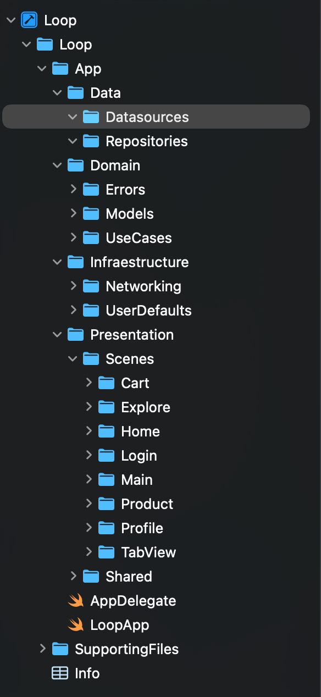

> [7. Estructura Inicial de Código](../7.md) › [7.1. Catálogo de Aplicaciones](7.1.md)

# 7.1. Catálogo de Aplicaciones

### 7.1.1. iOS (Swift) — Clean Architecture

La aplicación móvil para iOS está desarrollada en **Swift**, utilizando **SwiftUI** y **Combine**, bajo el patrón **Clean Architecture**.  
Este enfoque permite mantener un bajo acoplamiento entre capas, independencia de frameworks y alta testabilidad, siguiendo la dirección de dependencias **Presentation → Domain → Data**.

**Aplicación** | **Contenedor** | **Tecnología FE** | **Tecnología BE** | **BD (local)** | **Repositorio/Carpeta**
---|---|---|---|---|---
App iOS cliente | Mobile (iOS) | SwiftUI, Combine, MVVM | .NET API C# (REST) | UserDefaults / CoreData | `/ios/Loop`

> Estructura general del proyecto en Xcode:  
> 

---

#### Estructura de carpetas

- `Loop/App/Data/` — fuentes de datos, implementación de repositorios.  
- `Loop/App/Data/Datasources/` — acceso remoto (API REST) o local (UserDefaults, CoreData).  
- `Loop/App/Data/Repositories/` — implementación concreta de interfaces del dominio.  

- `Loop/App/Domain/` — entidades, errores y casos de uso del negocio (agnósticos de framework).  
- `Loop/App/Domain/Models/` — modelos de dominio como `Cart`, `Product`, `User`.  
- `Loop/App/Domain/UseCases/` — casos de uso principales: agregar producto, eliminar item, sincronizar carrito.  

- `Loop/App/Infrastructure/` — capa técnica: red, persistencia y servicios auxiliares.  
- `Loop/App/Infrastructure/Networking/` — cliente HTTP con `URLSession`, autenticación JWT, manejo de errores.  
- `Loop/App/Infrastructure/UserDefaults/` — almacenamiento ligero de preferencias y carrito invitado.  

- `Loop/App/Presentation/` — capa de presentación (UI + ViewModels).  
- `Loop/App/Presentation/Scenes/` — vistas y pantallas (SwiftUI) organizadas por módulo:  
  - `Cart/` — gestión del carrito (RF-GC-01, RF-GC-02).  
  - `Explore/` — catálogo de productos.  
  - `Product/` — detalle de producto.  
  - `Profile/` — perfil e historial de compras (RF-GC-09).  
  - `TabView/` — navegación principal.  
- `Loop/App/Presentation/Shared/` — componentes visuales reutilizables (botones, headers, estilos).

- `Loop/App/SupportingFiles/` — recursos, assets, configuraciones.  
- `Loop/App/Info/` — metadatos del proyecto (`Info.plist`).  
- `AppDelegate.swift` / `LoopApp.swift` — punto de entrada y configuración inicial del entorno.

---

#### Decisiones técnicas principales

- **Arquitectura:** Clean Architecture + MVVM (separación estricta de UI, dominio y datos).  
- **Estado global:** `@StateObject` + `ObservableObject` para reactividad y sincronización con backend.  
- **Networking:** `URLSession` con `async/await`, encabezados `Authorization` (JWT) y `X-Request-Id`.  
- **Persistencia:** `UserDefaults` para carrito local; `CoreData` opcional para cachear catálogo y precios.  
- **Casos de uso:** definidos en *Domain*, independientes de frameworks, probados con `XCTest`.  
- **Accesibilidad:** compatibilidad con *VoiceOver* y *Dynamic Type*.  
- **Integración backend:** consumo de endpoints `/carts`, `/checkout`, `/orders` del backend .NET + PostgreSQL.

---

#### Ejemplo de correspondencia conceptual

| Capa | Función | Ejemplo |
|------|----------|----------|
| **Data** | Fuente de datos (repositorios, API, almacenamiento) | `CartRepository.swift`, `CartRemoteDataSource.swift` |
| **Domain** | Lógica de negocio, entidades y casos de uso | `AddProductUseCase.swift`, `Cart.swift` |
| **Infrastructure** | Servicios de soporte técnico | `NetworkClient.swift`, `UserDefaultsService.swift` |
| **Presentation** | UI y ViewModels | `CartView.swift`, `CartViewModel.swift` |

---

> En conjunto, esta arquitectura garantiza independencia del framework, soporte offline-first y sincronización confiable del carrito, alineada con los requisitos funcionales y no funcionales del *Ecommerce de Ropa*.

---
### 7.1.2. Android (Kotlin) — Clean Architecture

[🏠 Home](../../README.md) | [Siguiente ➡️](../7.2/7.2.md)